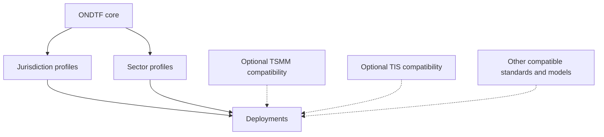

# Portfolio Alignment

## Canonical repositories

| Project | Role relative to ONDTF | Repository |
|---|---|---|
| Open National Digital Trust Framework (ONDTF) | Self-contained national-framework baseline | [GitHub](https://github.com/sankarshanmukhopadhyay/open-national-digital-trust-framework) |
| Trust Systems Meta-Model (TSMM) | Optional compatible reference meta-model | [GitHub](https://github.com/sankarshanmukhopadhyay/trust-systems-meta-model) |
| Trust Infrastructure Schemas (TIS) | Optional compatible schema and artefact suite | [GitHub](https://github.com/sankarshanmukhopadhyay/trust-infrastructure-schemas) |

## Reuse classifications

- **Core:** independently defined and governed by ONDTF.
- **Compatible reference:** useful for alignment or implementation but not required for core conformance.
- **Optional profile selection:** made mandatory only by a named jurisdiction, sector, or technical profile.
- **Informative:** influences explanation or design without creating a conformance dependency.
- **Alternative:** another model, schema, or protocol that satisfies equivalent ONDTF outcomes.

The [TSMM compatibility crosswalk](tsmm-crosswalk.md), [TIS compatibility profile](tis-adoption.md), [framework independence principle](framework-independence.md), and [ownership model](ownership-model.md) describe this relationship.
