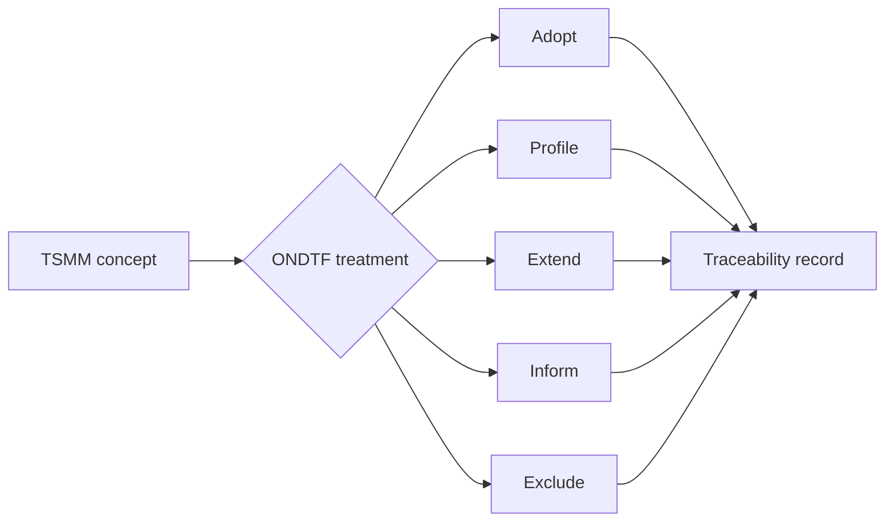

# TSMM Semantic Crosswalk

This informative crosswalk records how ONDTF concepts may align with [TSMM v0.23.0](https://github.com/sankarshanmukhopadhyay/trust-systems-meta-model). It is a compatibility aid, not a core dependency or prerequisite for ONDTF adoption.

| TSMM concept family | ONDTF use | Classification | ONDTF location |
|---|---|---|---|
| Entity and role | Identify participants, institutions, services, agents, and affected parties | Normatively profiled | Actor model and information model |
| Trust boundary | Delimit policy, authority, evidence, and operational control | Normatively profiled | Reference architecture and security |
| Authority graph | Represent mandate, delegation, attenuation, and accountability | Normatively profiled | Governance and authority model |
| Delegation patterns | Constrain derivative authority and establish lineage | Normatively profiled | Authority and delegation |
| Policy and runtime governance envelope | Bind interaction to applicable rules, duties, and context | Normatively profiled | Policy evaluation workflows |
| Interaction context and task | Describe the bounded transaction or activity | Adopted with national profile extensions | Information model |
| Evidence artefact and lifecycle | Establish provenance, freshness, and evaluation basis | Normatively profiled | Assurance and evidence model |
| Decision receipt | Record decision basis, authority, evidence, and admitted effect | Compatible reference | Decision records |
| Effect-centred trust decision | Evaluate whether a consequential effect may be admitted | Adopted | Trust model |
| Discovery governance | Govern service and participant discovery | Normatively profiled | Registry and federation architecture |
| Capability negotiation | Match requested activity to authorised capability | Normatively profiled | Implementation workflows |
| Observability and opacity boundaries | Declare what can be inspected and what remains hidden | Informative pending assurance profile | Assurance and agent profile |
| Agentic extension | Govern autonomous and delegated software actors | Normatively profiled | Agent sector profile |
| VTC extension | Model governed trust communities | Normatively profiled | Governance and trust-community model |

## Alignment rule

Where an ONDTF profile claims TSMM compatibility, differences must be recorded. ONDTF core terminology remains independently governed.

