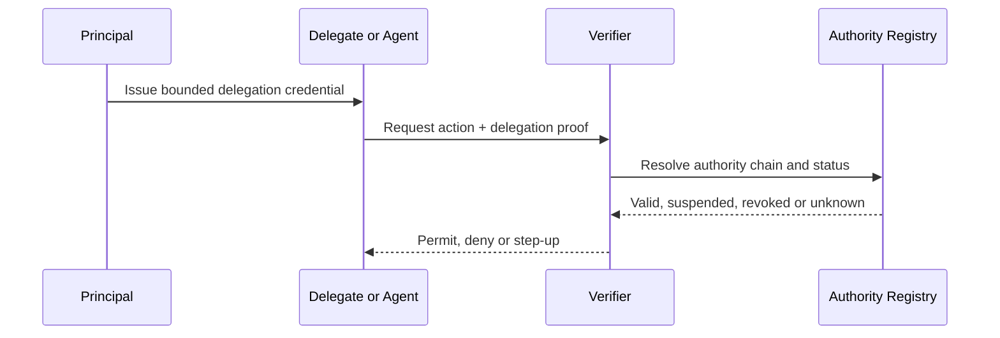

# Authority and Delegation

Identity establishes an actor. Authority establishes a permitted action.

A machine-verifiable authority statement SHOULD contain:

- principal;
- delegate;
- action or capability;
- object or resource;
- purpose;
- jurisdiction;
- valid-from and valid-until;
- transaction or value limits;
- delegation depth;
- conditions and obligations;
- revocation mechanism;
- evidence and audit requirements.

Delegation MUST NOT silently broaden through re-delegation. Each hop MUST preserve or narrow the original mandate unless the governing framework explicitly permits broader substitution.
