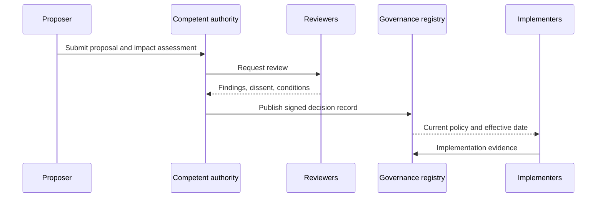

# Governance Decision Records

Material governance choices should produce an immutable, attributable decision record containing the decision, authority, affected scope, evidence considered, dissent or conflict declarations, effective date, review date, supersession conditions, and appeal route.

