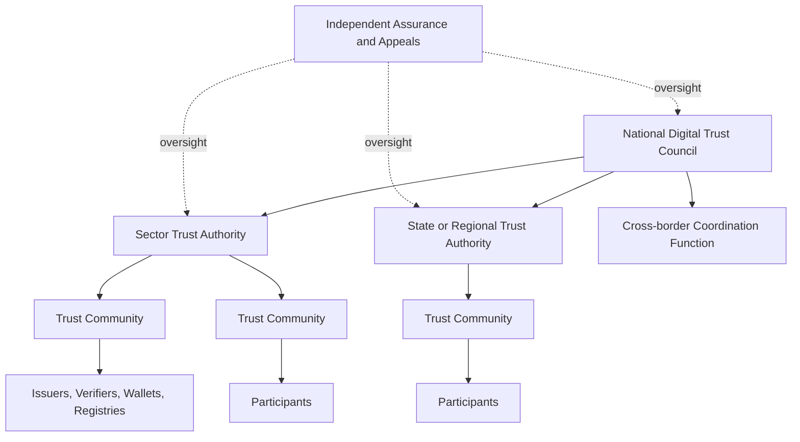

# Governance Framework

National digital trust requires coordinated governance without collapsing all authority into one institution.

## Federated governance model

## National-level functions

A national coordination body SHOULD:

- maintain the core framework and national profiles;
- coordinate standards participation;
- operate or designate root discovery services where necessary;
- accredit or recognise assurance and conformance bodies;
- publish common risk, accessibility and privacy requirements;
- coordinate cross-sector and cross-border recognition;
- maintain national incident and vulnerability coordination;
- avoid becoming the universal transaction intermediary.

## Governance artefacts

Every recognised trust scheme MUST publish machine-readable and human-readable versions of:

- scope and purpose;
- participant roles;
- decision rights;
- membership and removal rules;
- credential and authority policies;
- assurance requirements;
- liability allocation;
- incident response;
- audit and transparency obligations;
- complaints, appeals and remedies;
- change management and versioning.
