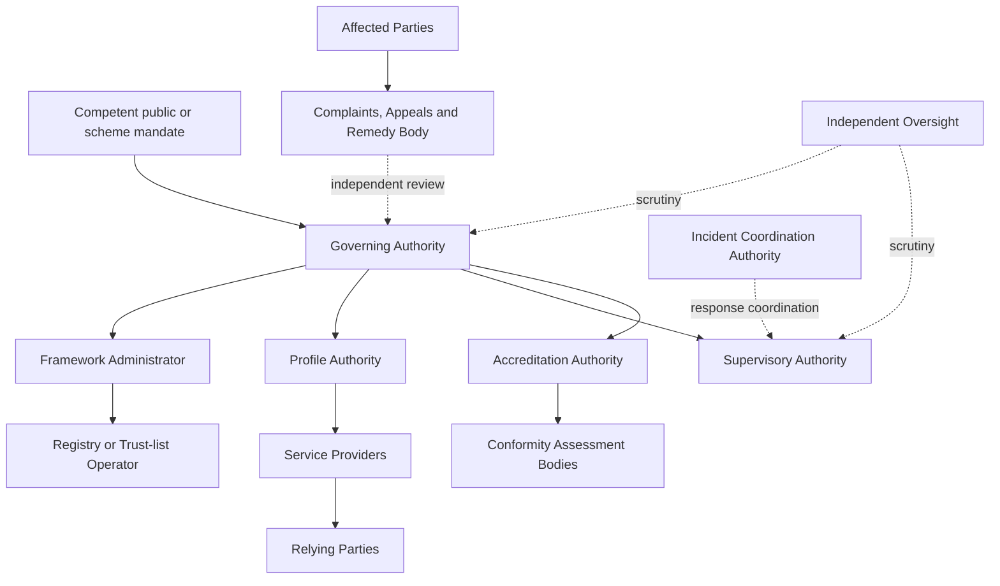

# Institutional operating model

ONDTF defines institutional functions and accountability boundaries without prescribing one national agency structure. A jurisdiction may assign several roles to one body, distribute one function among several bodies, or use recognised private and public institutions. The allocation must remain explicit, reviewable and consistent with applicable law.

## Operating model

The arrows show accountability or designation relationships, not a required legal hierarchy.

## Governing principles

- **Mandate before operation:** every institutional function must be grounded in a legal, policy, contractual or governance instrument.
- **Identity is not authority:** institutional recognition does not by itself authorise every decision or action.
- **Function before organisation:** responsibilities are defined before they are allocated to named bodies.
- **Separation where consequences require it:** rule setting, operation, assessment and final appeal should not be concentrated without safeguards.
- **Evidence-bearing decisions:** admission, suspension, exceptions, recognition and remedy decisions must be reviewable.
- **Affected-party standing:** people and organisations affected by trust decisions must have routes to challenge and remedy even where they are not direct scheme participants.

## Minimum controlled documents

An operational adoption must maintain:

- mandate and scope statement;
- role and authority register;
- decision-rights matrix;
- conflict-of-interest policy;
- delegation register;
- accreditation or recognition scheme;
- provider and service register;
- incident and emergency authority plan;
- complaints, appeals and remedy procedure;
- controlled-document and change register;
- transparency and performance report.
