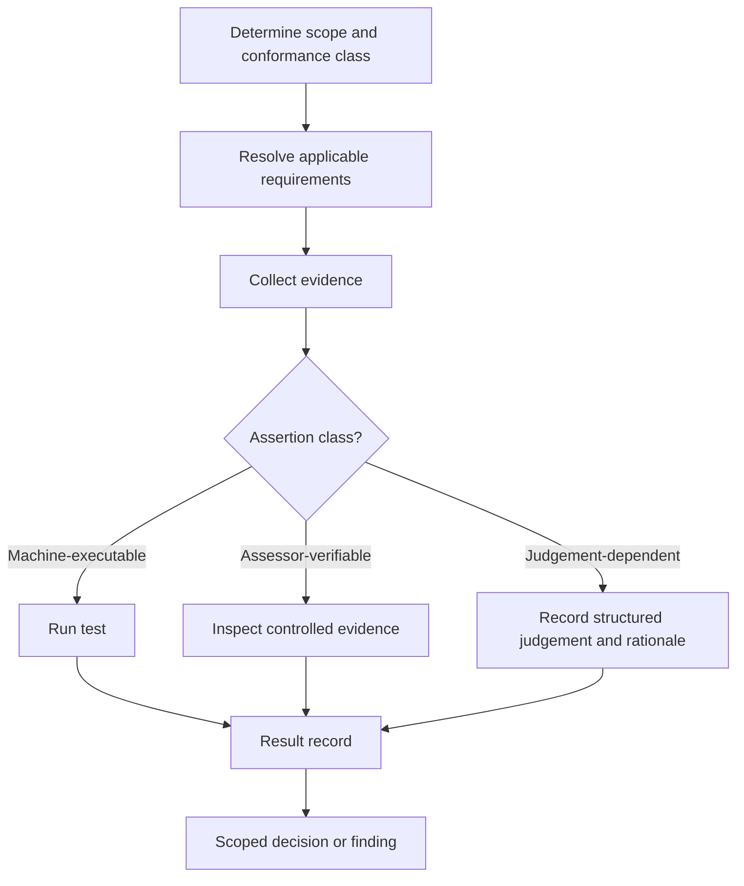

# Assessor guide

**Status:** informative guidance.

ONDTF distinguishes machine-executable, assessor-verifiable and judgement-dependent assertions. An assessor must record the assessed object, applicable profile and version, evidence inspected, assertion outcome, competence basis, limitations and any skipped or not-applicable tests. A repository validation result is not a provider or scheme conformance claim.

