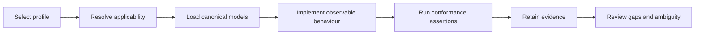

# Implementation getting started

**Status:** informative implementation guidance.

Start from the selected profile and canonical requirement catalogue, not from the reference implementation source code. Resolve applicability, load lifecycle and assurance models, implement observable decisions and evidence, then run the conformance assertions. The reference implementation is a demonstrator; it is never the source of a hidden normative obligation.

## Implementation path

Every controlled identifier such as ONDTF-AUT-002, ROLE-SA, PLT-008 or URI-04 is automatically resolvable through the Identifier Registry in the published site.
