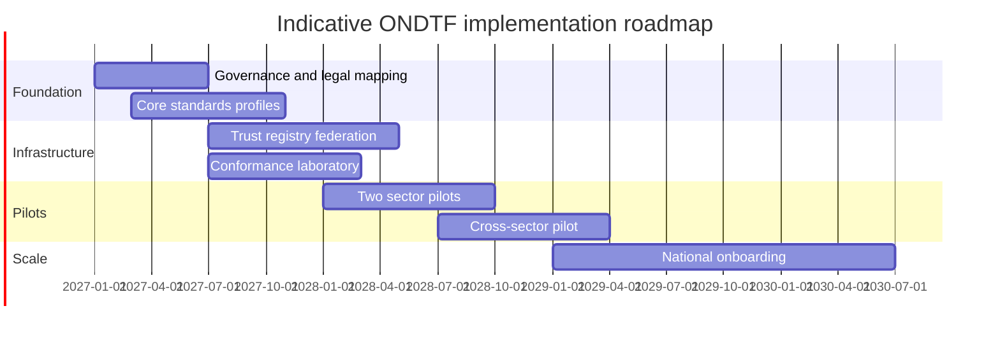

# Implementation Guide

## Recommended implementation sequence

1. Establish governance authority and scope.
2. Define sector use cases and harms.
3. Profile credentials, protocols and assurance levels.
4. Implement discovery and trust resolution.
5. Build wallet, issuer and verifier interoperability.
6. Establish status, audit and evidence services.
7. Conduct security, privacy and accessibility assessments.
8. Run conformance and adversarial tests.
9. Pilot with bounded legal and operational scope.
10. Scale only after independent review and published results.

