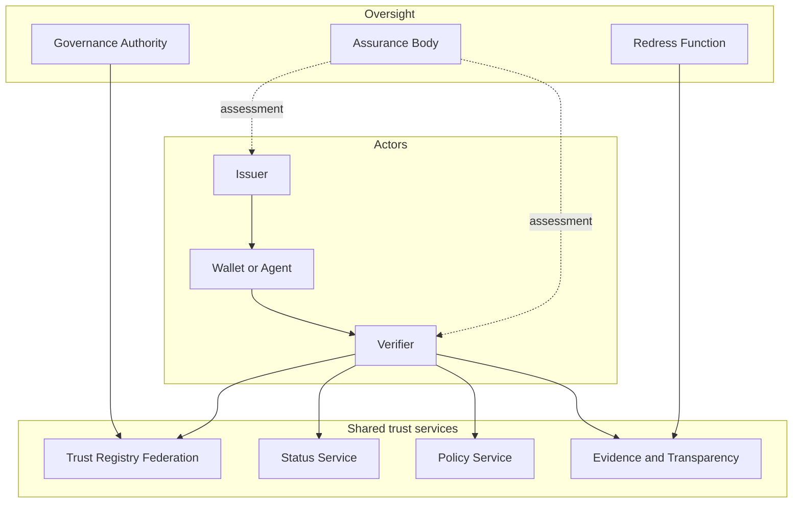

# Reference Deployment

This topology is illustrative. Shared services may be operated by public, sectoral, cooperative or accredited private entities. Critical services SHOULD avoid single-provider concentration.
