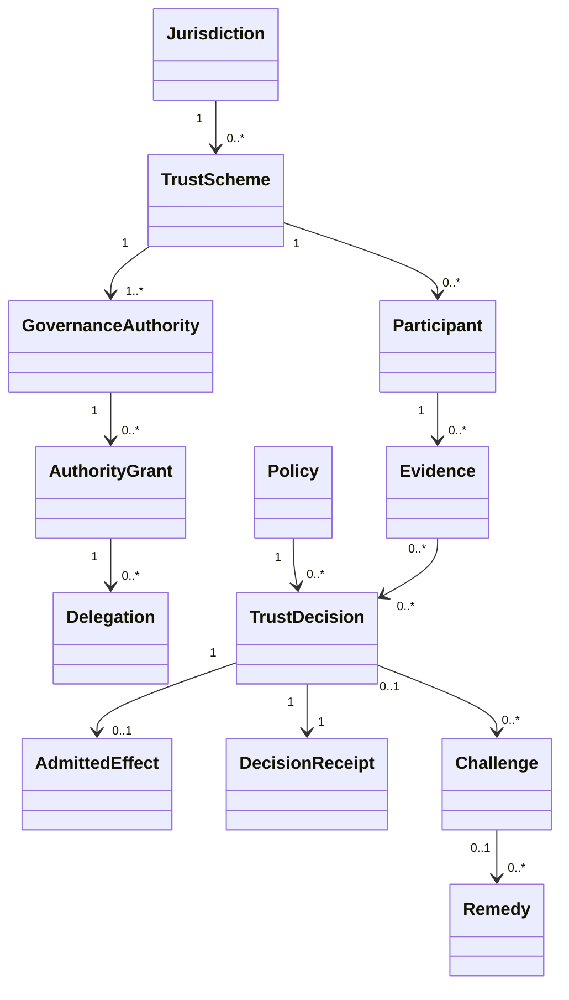

# ONDTF Information Architecture

The information architecture defines the minimum semantics needed to govern and interoperate across trust domains. It is deliberately independent of a particular schema language or data model. Profiles may bind these concepts to JSON, XML, RDF, relational models or other representations.

## Publication set

- [Canonical entity catalogue](canonical-entities.md)
- [Relationships and cardinalities](relationships.md)
- [Lifecycle and state models](state-models.md)
- [Identifiers and references](identifiers.md)
- [Provenance and integrity](provenance.md)
- [Information governance](information-governance.md)
