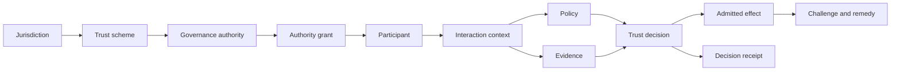

# Information Model

The ONDTF information model provides a self-contained vocabulary for architecture, profiles, controls, and conformance. Optional crosswalks connect it to TSMM, TIS, and other compatible resources. It provides a stable vocabulary for architecture, profiles, controls, and conformance.

See [entities](entities.md), [relationships](relationships.md), [lifecycle](lifecycle.md), and [identifier and provenance rules](identifiers-provenance.md).
