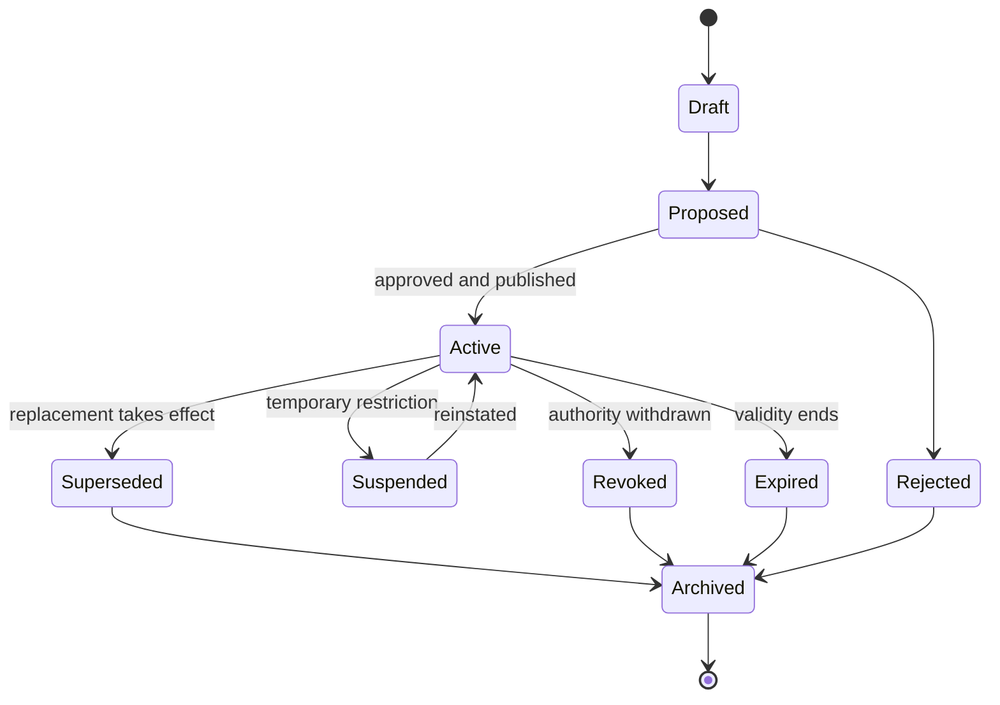

# Lifecycle and State

Lifecycle-sensitive decisions must evaluate status at a declared time and record the freshness of the status evidence. Historical evidence must remain interpretable after supersession or revocation without being mistaken for current authority.
