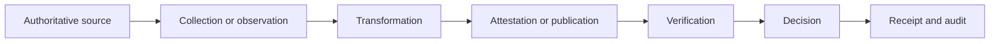

# Provenance and integrity

Provenance answers who created information, under what authority, from which sources, at what time and through which transformations.

## Minimum provenance chain

A provenance record SHOULD include:

- producer and authority;
- source references;
- collection or observation time;
- transformation history;
- integrity protection;
- policy and purpose;
- current status and expiry;
- disclosure or derivation method;
- verification events material to a decision.

A valid signature does not prove that source data was accurate, lawfully obtained or semantically fit. Assurance must address those questions separately.
