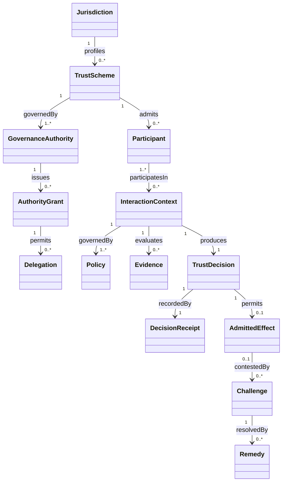

# Relationships and Cardinality

## Relationship rules

An admitted effect must be attributable to one trust decision. A trust decision must reference the applicable interaction context, policy basis, evaluating authority, and evidence set. Derived authority must preserve an unbroken lineage to a valid root authority. A challenge must remain linked to the challenged decision or effect even when the original artefact is superseded.
