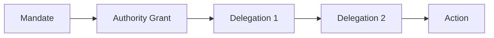

# Relationships and cardinalities

## Core relationships

| Source | Relationship | Target | Cardinality | Constraint |
|---|---|---|---|---|
| Jurisdiction | recognises | Trust Scheme | one-to-many | recognition may be conditional |
| Trust Scheme | governed by | Governance Authority | one-to-many | at least one accountable authority |
| Trust Scheme | admits | Participant | one-to-many | admission is role-specific |
| Participant | holds | Role | many-to-many | current status required |
| Governance Authority | issues | Authority Grant | one-to-many | grant must be versioned |
| Authority Grant | permits | Delegation | one-to-many | delegation cannot exceed source authority |
| Policy | governs | Trust Decision | one-to-many | effective version must be recorded |
| Evidence | supports | Claim | many-to-many | semantic relevance must be declared |
| Trust Decision | admits | Admitted Effect | one-to-zero-or-one | no effect without admission where required |
| Trust Decision | recorded by | Decision Receipt | one-to-one | receipt may be distributed |
| Challenge | contests | Evidence, Status or Decision | many-to-one | target must be identifiable |
| Remedy | resolves | Challenge or Incident | many-to-one | completion evidence required |
| Recognition Arrangement | maps | Trust Domains | one-to-many | mapping is bounded and revocable |

## Authority-chain invariant

Each link MUST be current, accepted where required, and no broader in action, purpose, subject, geography, time or onward-delegation rights than its parent.
