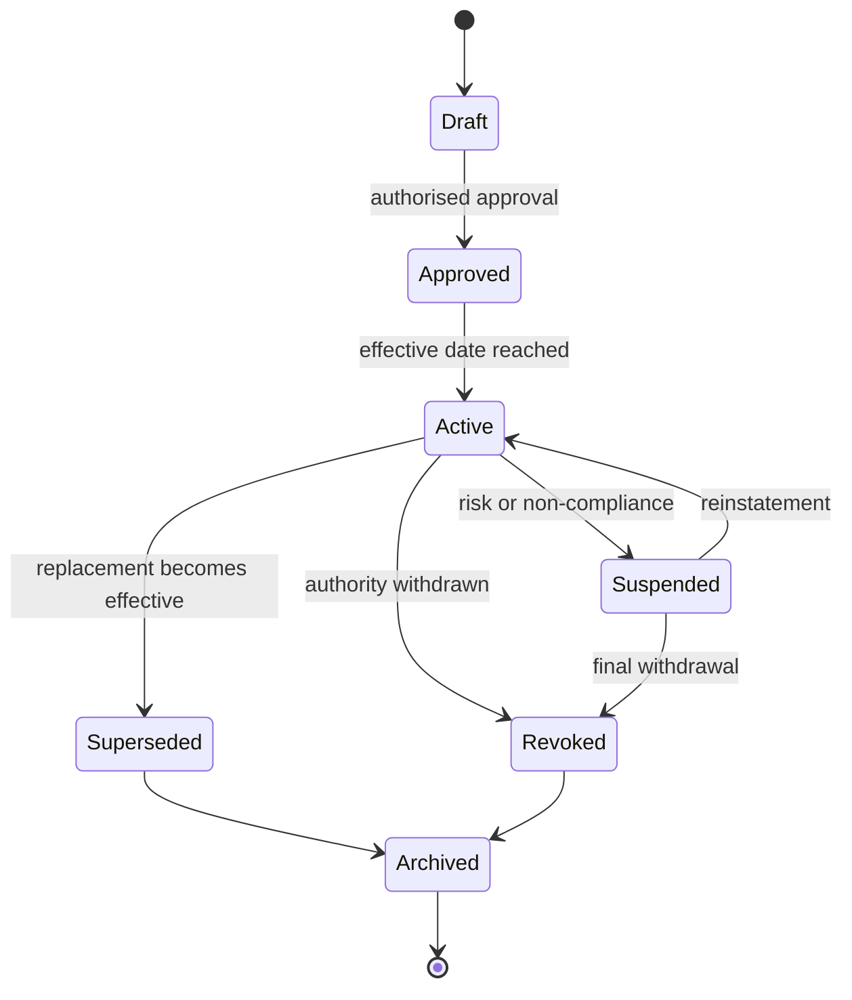
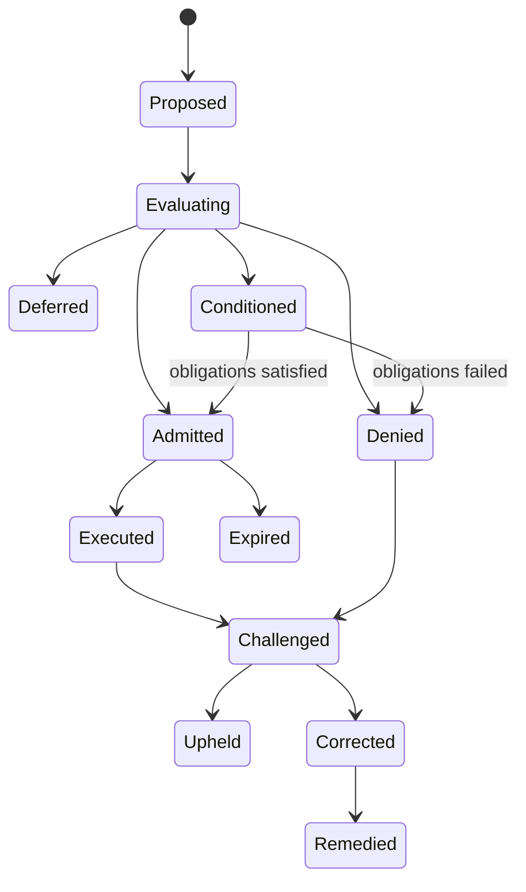

# Lifecycle and state models

State transitions are governance events. A transition MUST identify the authorised actor, effective time, reason and supporting evidence.

## Generic governed-entity lifecycle

## Decision lifecycle

## Required transition metadata

- entity identifier and prior state;
- requested and resulting state;
- transition authority;
- policy and reason code;
- decision time and effective time;
- evidence references;
- notification and review requirements.

Profiles MAY define additional states but MUST preserve the meaning of core terminal and restriction states.
