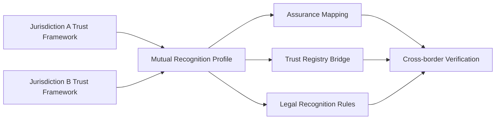

# International and Cross-border Interoperability

Cross-border trust requires more than technical format support. Mutual recognition SHOULD address:

- governance authority and legal effect;
- issuer eligibility;
- credential and protocol profiles;
- assurance-level mappings;
- status and revocation;
- liability and dispute resolution;
- data protection and transfer restrictions;
- audit and incident cooperation;
- termination and transition arrangements.

A jurisdiction SHOULD begin with bounded recognition pilots for specific credential types and relying-party purposes rather than attempting universal equivalence.

