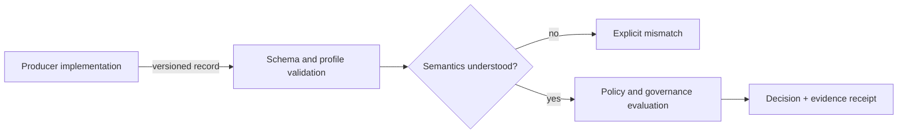
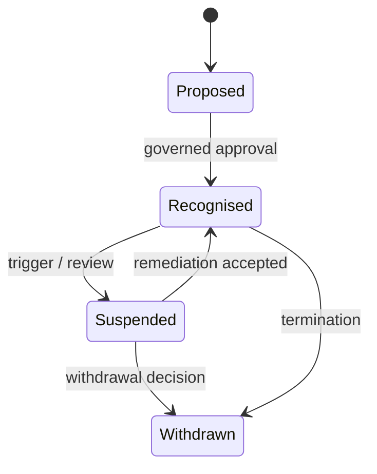

# Interoperability and recognition

**Status:** candidate implementation/evidence guidance. The core remains technology-neutral.

ONDTF treats interoperability as five distinct layers rather than as message exchange alone: syntactic, semantic, policy, governance and operational interoperability. The canonical profile is `IPR-001`.

## Recognition is not compatibility

Technical compatibility does not create institutional recognition. `REC-001` records the recognising authority, scope, exclusions, dimensional equivalence and suspension/withdrawal controls.

See the machine-readable artefacts in `model/interoperability/` and `model/recognition/` and the internal cross-implementation evidence in `evidence/interoperability/`.

- [Recognition Profile](recognition-profile.md)
- [Portable Semantics Vectors](portable-semantics-vectors.md)
