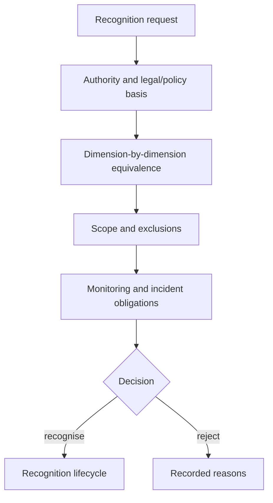

# Recognition profiles and equivalence

`REC-001` demonstrates bounded recognition. Equivalence is dimension-by-dimension (`EQV-001` through `EQV-004`), so an adoption can recognise attribution semantics while withholding equivalence for supervision or remedy.

