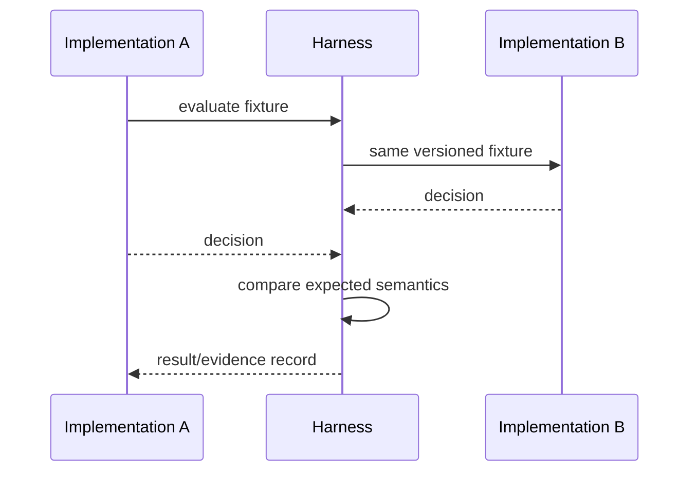

# Interoperability test event

The repository includes a deterministic **internal cross-codebase event**, `INT-EVT-001`. It runs the existing reference implementation against a separately authored implementation B for positive, suspended-provider, revoked-authority, stale-status and scope-mismatch cases.

This is useful implementation evidence but is intentionally **not described as an external interoperability event**. The limitation remains visible until independently operated implementations reproduce the matrix.

