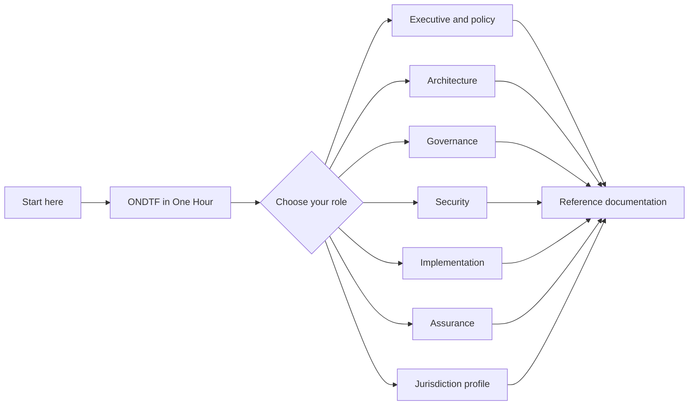

# Learn ONDTF

Use this section when you want to **understand the framework in a deliberate sequence**, rather than look up an individual topic. The reference navigation remains available in the sidebar; the paths below provide a guided journey through it.

{: .highlight }
> **New to ONDTF?** Start with [ONDTF in One Hour](one-hour.md). It gives you the problem statement, conceptual model, architecture, security posture, worked scenario, and next steps without requiring a cover-to-cover reading.

## Choose a path

| Path | Best for | Approximate time | Outcome |
|---|---|---:|---|
| [ONDTF in One Hour](one-hour.md) | First-time readers | 60 minutes | A complete mental model of the framework |
| [Executive and policy path](executive-policy.md) | Sponsors, policymakers, regulators | 90 minutes | Understand purpose, governance, risk, and adoption choices |
| [Architecture path](architecture.md) | Enterprise and solution architects | 3–4 hours | Understand layers, components, boundaries, information, and interactions |
| [Governance path](governance.md) | Scheme authorities and governance designers | 2–3 hours | Understand authority, delegation, decision rights, accountability, and redress |
| [Security path](security.md) | Security architects and risk teams | 3–4 hours | Trace assets, boundaries, threats, controls, evidence, and recovery |
| [Implementation path](implementation.md) | Delivery teams and operators | 3–4 hours | Move from framework decisions to an implementable programme |
| [Assurance and assessment path](assurance.md) | Auditors, assessors, accreditation teams | 2–3 hours | Understand assurance claims, evidence, conformance, and continuous review |
| [Jurisdiction profile path](jurisdiction.md) | National programme teams | 2–3 hours | Understand how to specialise ONDTF without weakening the core |

## How to use the site

1. Use a learning path for sequence and context.
2. Use the sidebar for reference lookup.
3. Use the **Previous** and **Next** links at the bottom of sequenced pages.
4. Follow the **Related reading** links when you need depth beyond the selected path.
5. Return to the [framework map](../documentation/framework-map.md) whenever you lose orientation.

