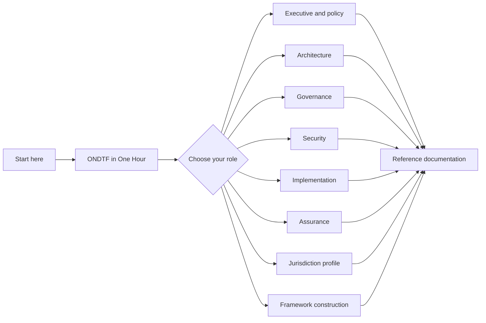
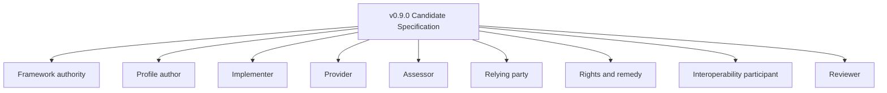

# Learn ONDTF

Use this section when you want to **understand the framework in a deliberate sequence**, rather than look up an individual topic. The reference navigation remains available in the sidebar; the paths below provide a guided journey through it.

{: .highlight }
> **New to ONDTF?** Start with [ONDTF in One Hour](one-hour.md). It gives you the problem statement, conceptual model, architecture, security posture, worked scenario, and next steps without requiring a cover-to-cover reading.

## Choose a path

| Path | Best for | Approximate time | Outcome |
|---|---|---:|---|
| [ONDTF in One Hour](one-hour.md) | First-time readers | 60 minutes | A complete mental model of the framework |
| [Executive and policy path](executive-policy.md) | Sponsors, policymakers, regulators | 90 minutes | Understand purpose, governance, risk, and adoption choices |
| [Architecture path](architecture.md) | Enterprise and solution architects | 3–4 hours | Understand layers, components, boundaries, information, and interactions |
| [Governance path](governance.md) | Scheme authorities and governance designers | 2–3 hours | Understand authority, delegation, decision rights, accountability, and redress |
| [Security path](security.md) | Security architects and risk teams | 3–4 hours | Trace assets, boundaries, threats, controls, evidence, and recovery |
| [Implementation path](implementation.md) | Delivery teams and operators | 3–4 hours | Move from framework decisions to an implementable programme |
| [Assurance and assessment path](assurance.md) | Auditors, assessors, accreditation teams | 2–3 hours | Understand assurance claims, evidence, conformance, and continuous review |
| [Jurisdiction profile path](jurisdiction.md) | National programme teams | 2–3 hours | Understand how to specialise ONDTF without weakening the core |
| [Framework construction path](framework-construction.md) | DTF design and facilitation teams | 3–5 hours | Construct and validate a governed DTF profile package |
| [Framework authority path](framework-authority.md) | Framework authorities | 90 minutes | Govern mandate, change and candidate release decisions |
| [Profile author path](profile-author.md) | Profile authors | 2 hours | Specialise ONDTF without weakening the core |
| [Provider path](provider.md) | Providers and service operators | 2 hours | Understand lifecycle, obligations and conformance |
| [Relying party path](relying-party.md) | Decision and relying services | 90 minutes | Evaluate authority, evidence, status and accountability |
| [Rights and remedy operator path](rights-remedy.md) | Complaint, appeal and remedy operators | 2 hours | Run affected-party processes and evidence |
| [Interoperability participant path](interoperability-participant.md) | Implementers and test-event teams | 2 hours | Test five-layer interoperability and mismatch semantics |
| [Candidate reviewer path](reviewer.md) | Specification and governance reviewers | 2 hours | Review normative coverage, limitations and change controls |

## How to use the site

1. Use a learning path for sequence and context.
2. Use the sidebar for reference lookup.
3. Use the **Previous** and **Next** links at the bottom of sequenced pages.
4. Follow the **Related reading** links when you need depth beyond the selected path.
5. Return to the [framework map](../documentation/framework-map.md) whenever you lose orientation.

```mermaid
flowchart LR
  START[Start here] --> HOUR[ONDTF in One Hour]
  HOUR --> ROLE{Choose your role}
  ROLE --> EP[Executive and policy]
  ROLE --> AR[Architecture]
  ROLE --> GV[Governance]
  ROLE --> SE[Security]
  ROLE --> IM[Implementation]
  ROLE --> AS[Assurance]
  ROLE --> JP[Jurisdiction profile]
  ROLE --> FC[Framework construction]
  EP --> REF[Reference documentation]
  AR --> REF
  GV --> REF
  SE --> REF
  IM --> REF
  AS --> REF
  JP --> REF
  FC --> REF
```

## Candidate review roles

The candidate release adds explicit entry routes for framework authority, profile author, provider, relying party, rights/remedy operator, interoperability participant and reviewer roles. Implementers and assessors continue to use their existing dedicated paths.

```mermaid
flowchart TD
  C[v0.9.0 Candidate Specification] --> FA[Framework authority]
  C --> PA[Profile author]
  C --> IM[Implementer]
  C --> PR[Provider]
  C --> AS[Assessor]
  C --> RP[Relying party]
  C --> RR[Rights and remedy]
  C --> IP[Interoperability participant]
  C --> RV[Reviewer]
```
