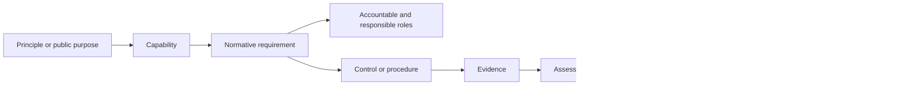

# Requirements traceability

Traceability connects ONDTF purpose to operational evidence and prevents requirements from becoming isolated statements.

## Traceability chain

## Minimum trace links

Every active requirement must link to:

- at least one accountable role;
- at least one evidence expectation;
- an applicability class;
- a release and lifecycle status.

Where available, it should also link to:

- a capability identifier;
- architectural component or interaction;
- control identifier;
- threat or risk;
- test or assessment assertion;
- affected-party journey.

## Traceability views

The canonical requirement catalogue supports at least four views:

1. **Role view:** obligations assigned to each institutional or participant role.
2. **Capability view:** requirements needed to deliver a framework capability.
3. **Evidence view:** artefacts needed to support assessment.
4. **Release view:** requirements introduced, changed, deprecated or withdrawn by version.

## Change impact

A normative change must identify affected profiles, controls, tests, evidence, roles and conformance claims. A change is not complete merely because the prose has been updated.
