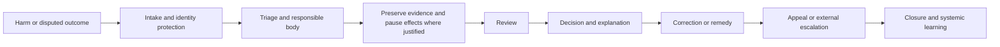

# Challenge and redress operations

Redress is an operating capability, not a policy aspiration. It must remain available across organisational and technical boundaries.

The operating model must define accessible intake, representation or assistance, urgent protective action, evidence access, impartial review, reasoned decisions, correction, compensation or restoration where available, appeal, and feedback into policy and control improvement.
