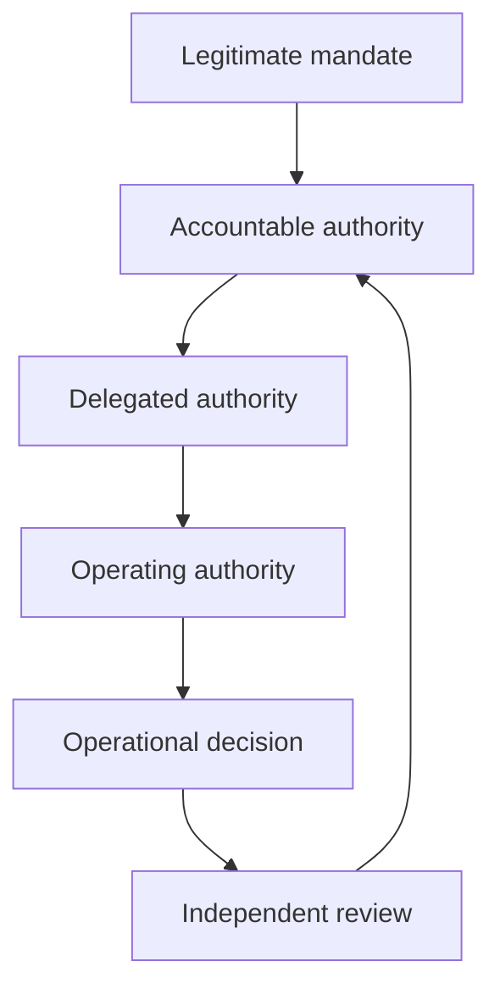

# Decision rights

Decision rights must be explicit enough to answer who may decide, under which mandate, over what scope, with which evidence, and subject to whose review.

## Decision categories

- establish or terminate the framework;
- approve or withdraw a jurisdiction profile;
- recognise a sector authority;
- establish, suspend, or retire a trust scheme;
- admit or remove a participant;
- approve assurance levels and assessors;
- designate authoritative sources and registries;
- activate emergency controls;
- determine incidents and notifications;
- decide appeals and remedies;
- recognise a foreign framework or scheme.

## Allocation model

Every delegated decision right must identify scope, constraints, evidence obligations, duration, review, and termination conditions.
