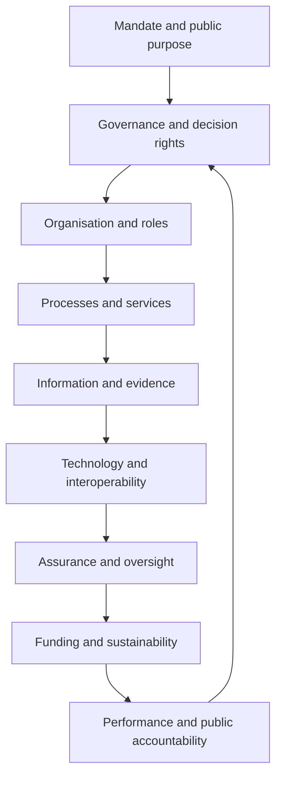

# National digital trust target operating model

The target operating model describes how a jurisdiction translates the ONDTF core into durable institutions, operating processes, services, assurance, and public accountability. It is not an organisational prescription. Different constitutional and administrative systems may allocate the functions differently.

## Operating-model domains

| Section | Purpose |
|---|---|
| [Operating model overview](overview.md) | Defines the model and adoption method |
| [Institutional functions](institutional-functions.md) | Identifies essential functions and separations |
| [Decision rights](decision-rights.md) | Allocates authority and accountability |
| [Trust-scheme lifecycle](trust-scheme-lifecycle.md) | Establishes formation through retirement |
| [Participant lifecycle](participant-lifecycle.md) | Governs admission, monitoring, suspension, and exit |
| [Policy and change management](policy-change-management.md) | Controls policy evolution and emergencies |
| [Oversight and transparency](oversight-transparency.md) | Establishes review, reporting, and conflicts controls |
| [Challenge and redress operations](challenge-redress.md) | Operationalises correction, appeal, and remedy |
| [Capability maturity](capability-maturity.md) | Supports staged national adoption |
