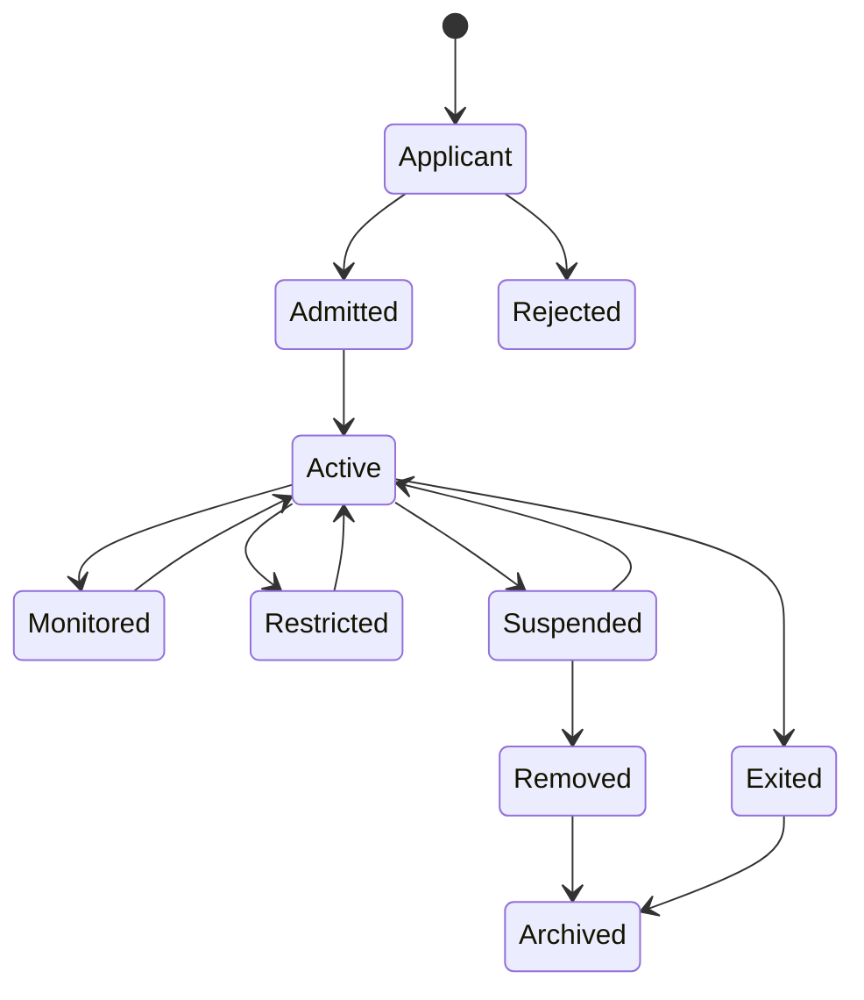

# Participant lifecycle

Participant governance must continue after initial onboarding. Admission is not a permanent assurance conclusion.

Admission criteria should address authority, competence, controls, conflicts, financial and operational resilience, evidence obligations, complaint handling, and exit readiness. Monitoring should be risk-based and capable of triggering step-up assessment, restriction, suspension, or removal.
