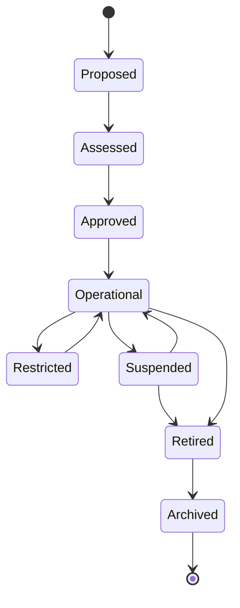

# Trust-scheme lifecycle

A trust scheme is a governed arrangement through which participants exchange or rely on evidence under common rules.

## Required lifecycle evidence

| Stage | Minimum evidence |
|---|---|
| Proposed | Purpose, affected parties, sponsor, scope, risk hypothesis |
| Assessed | Legal, security, privacy, assurance, interoperability, and sustainability assessment |
| Approved | Decision authority, effective date, profile, conditions, and review date |
| Operational | Participant register, service status, incidents, metrics, and changes |
| Restricted or suspended | Trigger, authority, scope, notification, continuity, and review |
| Retired | Exit plan, status preservation, data handling, outstanding obligations, and redress continuity |
| Archived | Retention basis, access controls, integrity, and disposal schedule |
