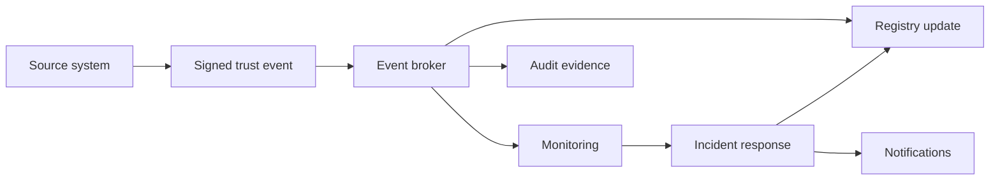

# National Trust Operations

The operational model supports national coordination while preserving sectoral autonomy.

## Core operational functions

- trust registry operations;
- participant onboarding and offboarding;
- key and certificate lifecycle management;
- status distribution and cache management;
- incident coordination;
- vulnerability disclosure;
- conformance testing;
- assurance surveillance;
- transparency reporting;
- dispute and appeal administration.

## Trust event pipeline

## Operational assurance integration

Operational monitoring, incident handling and service continuity feed the [Continuous Assurance and Trust Observability](../assurance/continuous-assurance.md) and [Operational Resilience](../assurance/operational-resilience.md) processes.

## Provider lifecycle package

- [Provider Lifecycle](provider-lifecycle.md)
- [Service Lifecycle](service-lifecycle.md)
- [Admission and Onboarding](admission-and-onboarding.md)
- [Material Change Management](material-change-management.md)
- [Monitoring and Surveillance](monitoring-and-surveillance.md)
- [Suspension, Restriction and Withdrawal](suspension-restriction-and-withdrawal.md)
- [Orderly Exit and Continuity](orderly-exit-and-continuity.md)
- [Trustmark and Status Publication](trustmark-and-status-publication.md)
