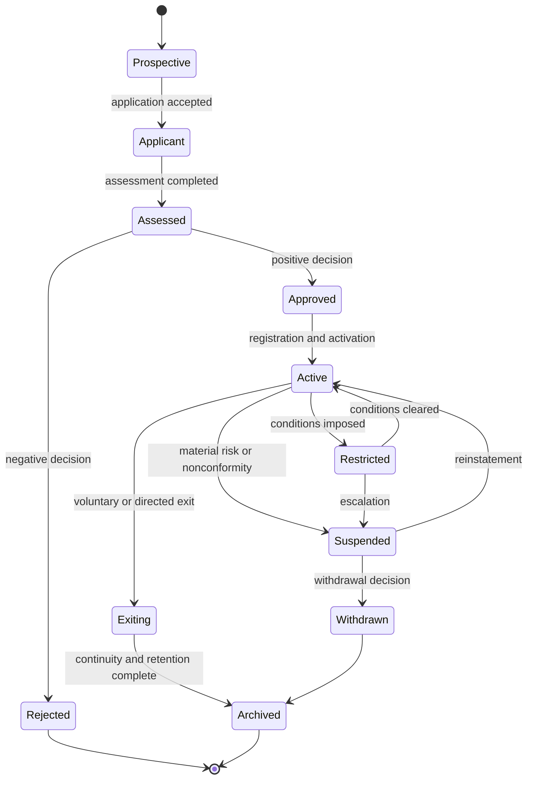

# Provider lifecycle

ONDTF treats participation as a governed lifecycle rather than a one-time registration event. A provider remains eligible only while its authority, assessed scope, service status and operating evidence remain current.

## Lifecycle states

The machine-readable state model is maintained in `model/operations/provider-lifecycle.yaml`.

## Governing requirements

A scheme profile MUST identify the authority responsible for admission, activation, restriction, suspension, reinstatement, withdrawal and exit. Each transition MUST have a recorded trigger, decision maker, evidence basis, effective time, notification duty and review route.

Provider approval MUST be scoped. It does not authorise services, jurisdictions, assurance levels or technical capabilities outside the assessed scope.

## Lifecycle controls

| Phase | Minimum controls | Primary evidence |
|---|---|---|
| Application | identity, authority, ownership, scope and conflict disclosures | application record |
| Due diligence | competence, financial, security, privacy and dependency review | due-diligence record |
| Assessment | requirement selection, evidence testing, findings and independence | assessment record |
| Approval | reasoned decision, conditions, validity and appeal route | approval decision |
| Activation | public status, service endpoints and effective time | register entry |
| Operation | monitoring, reporting, incident handling and change control | surveillance evidence |
| Restriction or suspension | proportionate control, notice, status propagation and review | status decision |
| Exit | continuity, participant migration, data disposition and archival | exit plan and closure record |

## Guided-construction hooks

The lifecycle model exposes decision points that the ONDTF Guided Framework Construction flow can ask adopters to resolve, including admission authority, evidence thresholds, validity periods, change triggers, suspension grounds, continuity obligations and appeal routes. These hooks are declared in `model/adoption/construction-input-contract.yaml` and do not yet constitute the Commit 4 questionnaire.
