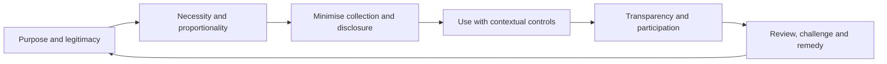

# Privacy architecture

Privacy constrains the entitlement and manner of processing information about people, relationships, behaviour, and consequential decisions. A secure ONDTF deployment can still be privacy-invasive if it collects excessive data, enables correlation, or makes participation conditional on unnecessary disclosure.

## Publication set

- [Privacy Architecture and Principles](privacy-architecture-principles.md)
- [Selective Disclosure and Unlinkability](selective-disclosure-unlinkability.md)
- [Registry and Status-query Privacy](registry-query-privacy.md)
- [Consent and Alternative Bases](consent-alternatives.md)
- [Privacy Impact Assessment](privacy-impact-assessment.md)
- [Privacy Threats and Controls](privacy-threats-controls.md)

The framework is informed by ISO/IEC 29100:2024, ISO/IEC 27701:2025, ISO/IEC 29134:2023, ISO/IEC 27561:2024, and the NIST Privacy Framework. These are informative sources and do not create automatic conformity claims.
