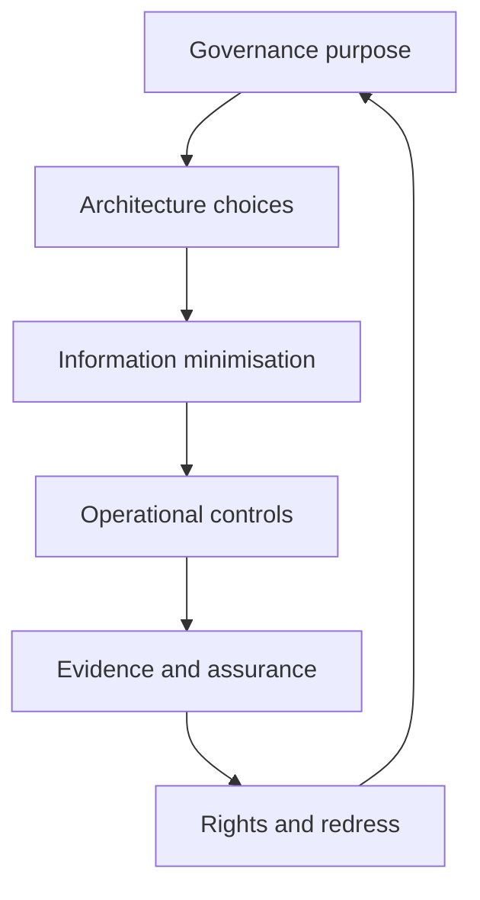

# Privacy architecture and principles

ONDTF adopts privacy-by-design and privacy-by-default across governance, architecture, information, implementation, operation, assurance, and redress.

Core principles are purpose legitimacy, necessity, proportionality, minimisation, accuracy, use limitation, transparency, individual participation, security safeguards, accountability, retention limitation, and contestability.

Privacy requirements apply to direct identifiers, pseudonymous identifiers, relationship metadata, registry queries, credential presentations, status checks, decision receipts, logs, and inferred attributes.
