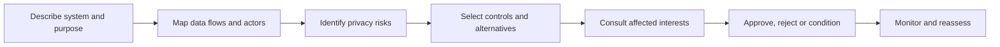

# Privacy impact assessment

A privacy impact assessment SHOULD occur before high-risk processing begins and whenever purpose, data, technology, parties, scale, jurisdiction, or consequences materially change.

The assessment records necessity, proportionality, affected parties, data categories, correlation pathways, vulnerable groups, automated decisions, transfers, retention, threats, controls, residual risk, approval, and review date.
