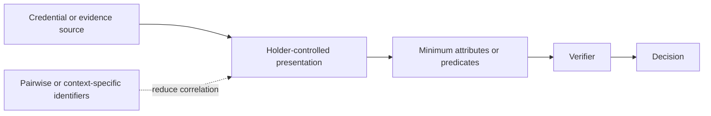

# Selective disclosure and unlinkability

A verifier SHOULD receive only the attributes or predicates necessary for its declared decision. Implementations SHOULD support presentation mechanisms that reduce unnecessary disclosure and correlation where the assurance objective permits.

Unlinkability is not absolute. Network metadata, timing, rare attributes, status endpoints, wallet attestation, and repeated identifiers can reintroduce correlation. Profiles SHALL document residual linkability and the parties capable of performing it.
