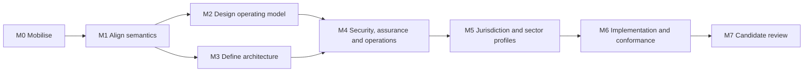

# Programme Management

This section defines how ONDTF is developed as a controlled, multi-release standards programme. It provides the delivery discipline normally expected in a national-scale transformation: clear scope, accountable decisions, managed dependencies, measurable quality gates, and evidence-based release approvals.

## Programme outcomes

The programme will mature ONDTF from an initial seed into a candidate specification that is:

- semantically aligned with [TSMM](https://github.com/sankarshanmukhopadhyay/trust-systems-meta-model);
- operationally connected to [TIS](https://github.com/sankarshanmukhopadhyay/trust-infrastructure-schemas);
- jurisdiction-neutral at its core;
- profileable for countries and sectors;
- testable through conformance artefacts; and
- publishable in full through GitHub Pages.

## Delivery model

See the [programme charter](charter.md), [integrated workplan](workplan.md), [quality gates](quality-gates.md), and [decision rights](decision-rights.md).
