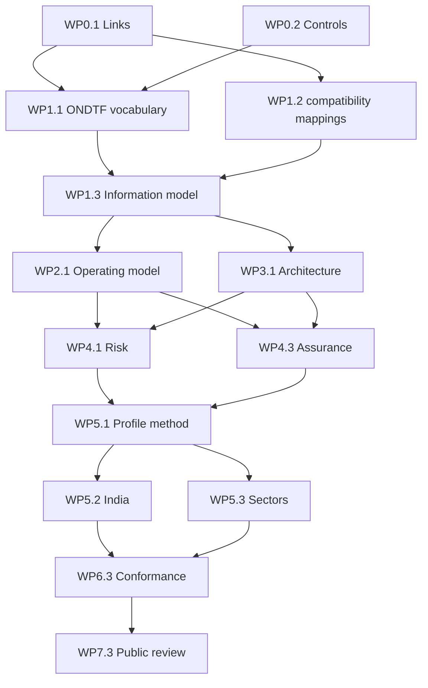

# Integrated Workplan

## Milestones and work packets

| Milestone | Work packets | Principal outputs | Release |
|---|---|---|---|
| M0 Mobilisation | WP0.1 canonical links; WP0.2 programme controls | Dependency register, charter, RACI, quality gates | v0.1.1 |
| M1 Alignment | WP1.1 ONDTF vocabulary; WP1.2 optional compatibility mappings; WP1.3 information model | Bindings, ownership matrix, canonical information model | v0.2.0 |
| M2 Operating model | WP2.1 target operating model; WP2.2 governance; WP2.3 ecosystem | Institutional model, processes, capability map | v0.3.0 |
| M3 Architecture | WP3.1 architecture; WP3.2 workflows; WP3.3 federation | Architecture views, interfaces, workflow specifications | v0.4.0 |
| M4 Risk and assurance | WP4.1 threats; WP4.2 privacy; WP4.3 assurance; WP4.4 operations | Control framework, evidence model, operational model | v0.5.0 |
| M5 Profiles | WP5.1 profile method; WP5.2 India; WP5.3 sectors | Jurisdiction and priority sector profiles | v0.6.0–v0.7.0 |
| M6 Enablement | WP6.1 implementation; WP6.2 APIs; WP6.3 conformance | Guidance, OpenAPI, fixtures, tests | v0.8.0 |
| M7 Candidate | WP7.1 publication; WP7.2 evidence; WP7.3 public review | Candidate bundle and disposition record | v0.9.0 |

## Sequencing

## Cross-cutting streams

Documentation engineering, risk management, stakeholder engagement, architecture decisions, accessibility, and traceability operate throughout all milestones rather than being deferred to the end.
