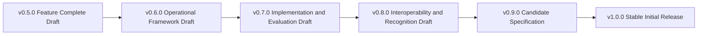

# Maturation and adoption roadmap

## v0.6.0

Operationalise the architecture through normative role obligations, an institutional operating model, provider lifecycle, conformance and accreditation architecture, profile construction kit, assurance dimensions, controlled-document maintenance, disciplined external-pattern adoption, and the governed foundation for sector-specific standards mapping and adoption decisions.

## v0.7.0

Test the model through independent implementation, executable conformance fixtures, public-services and financial-services standards-adoption pilots, privacy-pattern comparison, accessibility and remedy journeys, adversarial exercises and initial empirical calibration.

## v0.8.0

Demonstrate cross-implementation interoperability, performance and recovery evidence, cross-framework recognition, assurance equivalence, cross-sector standards compatibility and profile compatibility.

## v0.9.0

Stabilise normative language, close or formally accept high-severity issues, complete traceability, document independent review, stabilise the sectoral standards register and enforce credible change control.

## v1.0.0

Publish a stable initial release grounded in operational and interoperability evidence rather than further architectural expansion.
