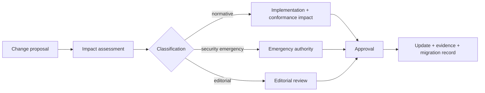

# Candidate freeze and change control

**Status:** candidate governance process.

`NCP-001` through `NCP-005` identify the candidate normative surface. Candidate freeze means identifiers and normative semantics are stable enough for implementation review; it does not mean defects cannot be corrected.

A normative change after the v0.9.0 freeze requires a change record containing: problem statement, affected requirements/profiles, backwards-compatibility class, implementation impact, conformance impact, migration treatment, evidence impact, reviewer disposition and approval.

## Change classes

| Class | Meaning | Candidate treatment |
|---|---|---|
| Editorial | No change to normative meaning | normal review |
| Clarification | Removes ambiguity without changing expected outcome | impact check + tests |
| Compatible normative | Strengthens or corrects semantics without invalidating conforming behaviour | governed proposal + evidence |
| Breaking normative | Changes required observable behaviour or identifier semantics | migration plan + renewed candidate review |
| Security emergency | Immediate change required to bound material harm | expedited approval + retrospective review |

