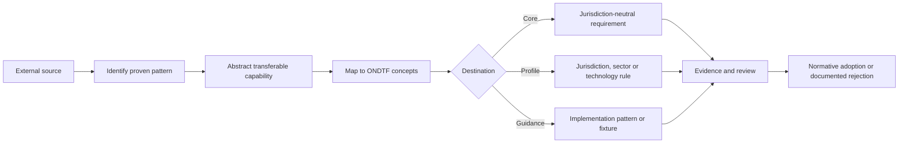
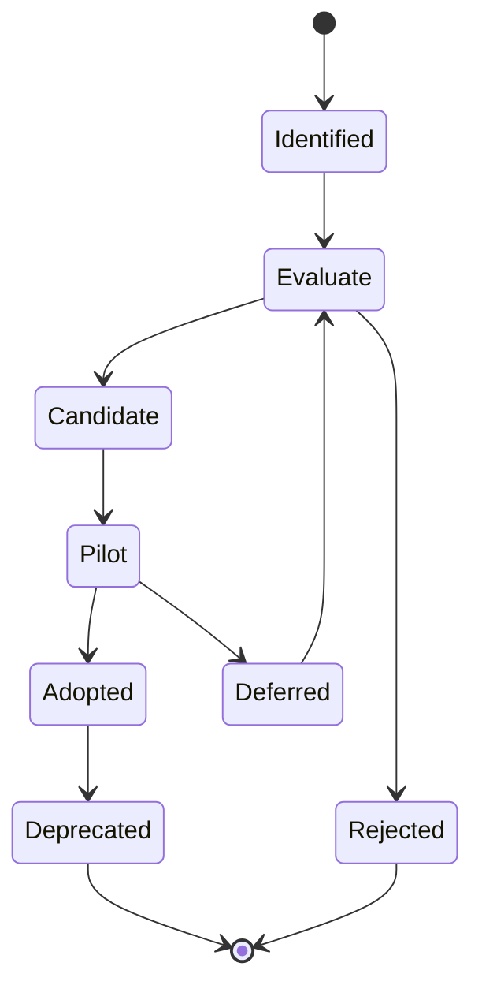

# External framework pattern adoption

## Purpose

ONDTF does not seek to replace mature regulatory regimes, national digital identity frameworks, governance metamodels, technical standards, management systems, sector schemes or deployed digital public infrastructure. It instead identifies proven patterns from those sources, abstracts the capability that makes each pattern useful, maps that capability into ONDTF concepts, and adopts it only where the result remains internally coherent, jurisdiction-aware and testable.

This page is the architectural bridge between the v0.5.0 Feature Complete Draft and the operationalisation work planned for v0.6.0 and later releases. The canonical adoption records are maintained in [`model/project/maturation-register.yaml`](../../model/project/maturation-register.yaml).

## Governing principle

> ONDTF adopts proven capabilities rather than copying branded frameworks, statutory clauses or technology stacks. Every adoption must preserve source attribution, declare its destination in the ONDTF core, a profile or implementation guidance, and identify the evidence required before the pattern becomes normative.

## Why disciplined adoption is necessary

Existing digital trust initiatives are not all the same kind of instrument. Some create legal effect, some regulate providers, some define governance documents, some establish technical interoperability, some govern organisational risk, and some are production ecosystems operating at national scale. Treating them as interchangeable would import incompatible role models, jurisdictional assumptions and assurance semantics into ONDTF.

ONDTF therefore uses the following transformation path:

## Adoption principles

1. **Adopt capabilities, not brands.** ONDTF records the underlying mechanism and its purpose rather than presenting another framework as universally authoritative.
2. **Separate architecture from legal effect.** Legal recognition, liability, supervision and enforcement remain jurisdiction-specific even where their operating patterns are reusable.
3. **Profile rather than fork.** Existing protocols and sector standards should be selected and constrained through profiles, not rewritten inside ONDTF.
4. **Preserve technology neutrality in the core.** Technology-specific requirements belong in explicit technology or sector profiles.
5. **Retain source attribution and edition control.** Adopted patterns must identify their source family and any selected standards through the maintained [standards and specifications register](../standards/references.md).
6. **Require semantic mapping.** Similar terminology does not establish equivalence. Roles, evidence, assurance and lifecycle states must be mapped explicitly.
7. **Make adoption falsifiable.** Each pattern must state the implementation, review or test evidence needed before its status advances.
8. **Protect ONDTF’s architectural through-line.** Imported patterns must strengthen the connection between identity, authority, evidence, decision, effect, accountability and remedy.
9. **Avoid false legal or conformity claims.** An architectural mapping does not create statutory accreditation, qualified status, recognition or certification.
10. **Govern change.** A pattern must have an owner, target release, status, dependencies and migration path.

## Source-framework taxonomy

| Family | Representative examples | Transferable strength | ONDTF use |
|---|---|---|---|
| Regulatory trust-service frameworks | eIDAS and the EU Digital Identity Framework | Legal effect, supervision, qualified status and cross-border recognition | Jurisdiction and recognition profiles |
| National digital identity trust frameworks | UK DVS, Australian Digital ID, New Zealand DISTF | Provider obligations, accreditation, registers, trustmarks and enforcement | Conformance, provider lifecycle and supervisory profiles |
| Modular trust-framework and governance metamodels | PCTF and Trust Over IP governance specifications | Modular components, controlled documents and role separation | Core governance package and profile construction |
| Assurance, risk and management-system standards | NIST SP 800-63, NIST CSF, ISO/IEC 27001, ISO/IEC 42001 and ISACA DTEF | Assurance levels, risk treatment, controls, auditability and management discipline | Assurance model and organisational overlays |
| Sector operational frameworks | Open Banking, Consumer Data Right, FDX and Brazilian Open Finance | Participant certification, API security, consent, service levels and incident obligations | Sector profiles and implementation tests |
| Digital public infrastructure ecosystems | India Stack, e-Estonia, Singapore NDI, Bhutan NDI and gov.br | Scale, integration, recovery and public-service operations | Deployment patterns, performance and recovery evidence |
| Technical interoperability specifications | W3C VC and DID, OpenID protocols, FIDO2, ISO mdoc and trusted lists | Credential, authentication, federation, status and cryptographic interoperability | Profile-selected technical dependencies |

The taxonomy prevents a common category error: legislation, certification schemes, architectures, technical specifications and deployed ecosystems may inform one another, but they cannot be adopted through the same mechanism.

## Pattern destinations

| Destination | Meaning | Admission test |
|---|---|---|
| **Core** | A jurisdiction-neutral responsibility, concept or governance requirement | The pattern is broadly applicable and does not depend on a particular legal regime or technology stack. |
| **Profile** | A jurisdiction, sector, service or technology-specific requirement | The pattern requires contextual authority, selected dependencies, thresholds, liability or operating rules. |
| **Implementation guidance** | A recommended mechanism, fixture, comparison or deployment pattern | Multiple implementations may satisfy the same ONDTF requirement and operational evidence is still developing. |

## Candidate pattern catalogue

| ID | Pattern | Source strength | ONDTF destination | Target | Status |
|---|---|---|---|---|---|
| EPA-001 | Independent conformity assessment | National schemes and ISO conformity assessment | Core | v0.6.0 | Candidate |
| EPA-002 | Provider accreditation and certification lifecycle | UK, Australia, New Zealand and sector schemes | Profile | v0.6.0 | Candidate |
| EPA-003 | Supervisory authority, public register and recognition status | eIDAS and national schemes | Profile | v0.6.0 | Candidate |
| EPA-004 | Controlled governance document set | Modular governance metamodels | Core | v0.6.0 | Candidate |
| EPA-005 | Role-specific normative obligations | National and sector trust frameworks | Core | v0.6.0 | Candidate |
| EPA-006 | Multi-dimensional assurance levels | NIST and assurance standards | Core | v0.6.0 | Candidate |
| EPA-007 | Modular profile construction | PCTF-style modularity and governance metamodels | Core | v0.6.0 | Candidate |
| EPA-008 | Sector participant and service obligations | Open finance and regulated API ecosystems | Profile | v0.6.0 | Candidate |
| EPA-009 | Cross-framework recognition profile | Cross-border and trusted-list regimes | Profile | v0.8.0 | Candidate |
| EPA-010 | Accessible challenge, appeal and remedy operations | Regulatory and national frameworks | Core | v0.6.0 | Candidate |
| EPA-011 | Consent and authorisation evidence for data exchange | Open finance and DPI ecosystems | Profile | v0.6.0 | Candidate |
| EPA-012 | Privacy-preserving status and registry resolution | Credential and status specifications | Implementation guidance | v0.7.0 | Evaluate |
| EPA-013 | Executable conformance fixtures | Technical and sector conformance programmes | Implementation guidance | v0.7.0 | Candidate |
| EPA-014 | Interoperability and scale test events | Sector ecosystems, DPI and protocol communities | Implementation guidance | v0.8.0 | Candidate |
| EPA-015 | Continuous assurance and operational exercise evidence | Risk frameworks and deployed ecosystems | Core | v0.7.0 | Candidate |
| EPA-016 | Reference and controlled-document maintenance | Regulatory, governance and management systems | Core | v0.6.0 | Candidate |

The catalogue is a planning and decision register. “Candidate” does not mean already normative. A pattern advances only after its safeguards, evidence and traceability are satisfied.

## Pattern-to-ONDTF mapping

### Governance and institutional operation

EPA-003, EPA-004 and EPA-005 strengthen the governing-authority, supervisory-authority, controlled-document and decision-right structures already present in ONDTF. They should provide a national deployment with explicit responsibility for rulemaking, administration, assessment, status publication, incident coordination, appeals and change control without assuming that one institution must perform every function.

### Conformance and provider lifecycle

EPA-001 and EPA-002 distinguish repository integrity, implementation conformance and organisational or scheme conformance. They introduce the missing lifecycle from application and assessment through surveillance, suspension, withdrawal, appeal and public status. Statutory terms such as “accredited”, “qualified” or “certified” remain available only where an authorised profile creates them.

### Assurance

EPA-006 and EPA-015 adapt the strongest feature of mature assurance frameworks without creating a single trust score. ONDTF should maintain distinct dimensions for identity, authority, delegation, credential, operational and remedy assurance, with profile-specific thresholds and continuous evidence.

### Profiles and recognition

EPA-007, EPA-008, EPA-009 and EPA-011 provide the mechanism through which jurisdictions and sectors select legal rules, participant duties, technical dependencies, consent or authorisation evidence and recognition relationships. The core defines what must be declared; the profile supplies the contextual answer.

### Rights and remedy

EPA-010 makes accessible notice, evidence access, challenge, independent review and remedy part of trust-system operation. It does not replace local procedural law, but it prevents implementations from treating redress as an unrelated support function.

### Implementation evidence

EPA-012, EPA-013 and EPA-014 retain competing technical patterns where evidence is insufficient for universal selection. Comparative tests, negative fixtures and multi-implementation events should determine profile guidance rather than architectural preference alone.

### Maintenance

EPA-016 treats standards, profiles, mappings and controlled documents as governed dependencies. Broken-link checking is useful, but substantive source changes require human impact review, version decisions and migration planning.

## Adoption decision procedure

A pattern adoption proposal must include:

1. a stable EPA identifier;
2. source family and source references;
3. the problem the pattern addresses;
4. mapped ONDTF concepts and requirements;
5. proposed destination: core, profile or implementation guidance;
6. jurisdictional, semantic and technology assumptions;
7. incompatibility and transplantation risks;
8. required evidence and review;
9. target release and owner role;
10. a decision of adopt, adapt, defer or reject.

A pattern must not become normative merely because it is widely deployed. Adoption requires a reasoned decision showing that the pattern fits ONDTF’s authority, evidence, effect and remedy architecture.

## Status lifecycle

| Status | Meaning |
|---|---|
| Identified | A potentially useful external pattern has been recorded. |
| Evaluate | Semantic fit, assumptions and alternatives are under analysis. |
| Candidate | The intended ONDTF destination and required evidence are defined. |
| Pilot | The pattern is being tested in a profile or implementation. |
| Adopted | The pattern has approved normative or guidance status. |
| Deferred | Evidence or dependencies are insufficient for the target release. |
| Rejected | The pattern conflicts with ONDTF or provides no justified benefit. |
| Deprecated | A previously adopted pattern is being withdrawn or replaced. |

## Release mapping

### v0.6.0: Operational Framework Draft

The first operationalisation release should decide and implement the patterns for role obligations, institutional governance, accreditation architecture, provider lifecycle, modular profiles, assurance dimensions, rights operations and controlled-document maintenance.

### v0.7.0: Implementation and Evaluation Draft

The next release should test the adopted structures through executable conformance fixtures, privacy-pattern comparisons, incident exercises, accessibility journeys, remedy pilots and at least one independent implementation.

### v0.8.0: Interoperability and Recognition Draft

This release should add multi-implementation evidence, scale and recovery results, recognition profiles and assurance-equivalence decisions grounded in observed interoperability.

### v0.9.0: Candidate Specification

Candidate status should require stable normative language, resolved high-severity adoption questions, complete requirement-to-evidence traceability, multiple independent implementations and credible change control.

## Relationship to the maturation register

External-pattern adoption is not a separate ideas backlog. Each EPA record links to one or more unresolved issues, maturation programmes and release gates in the canonical maturation register. The coordinated project views are:

- [Known Limitations](known-limitations.md): what ONDTF deliberately does not yet claim or provide;
- [Unresolved Issues Register](unresolved-issues.md): the evidence-bearing questions that remain open;
- [Future Work](future-work.md): the programmes and release sequence for resolving maturity gaps;
- [Maturation Governance](maturation-governance.md): how these views are kept coherent;
- this page: which external patterns may address a documented need and under what safeguards.

## Initial decision for v0.6.0 planning

The candidate catalogue is sufficiently bounded to seed v0.6.0 planning, but it does not pre-approve all sixteen patterns. The v0.6.0 scope should select only those patterns required to close or materially advance URI-07 through URI-12, URI-18 and URI-19. Patterns targeted at v0.7.0 or v0.8.0 should remain evidence-led rather than being pulled forward to enlarge the release.
