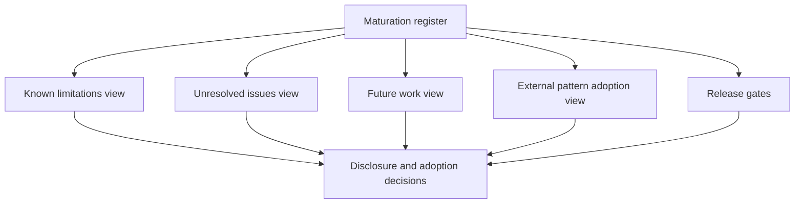

# Maturation governance

## Purpose

ONDTF maintains one canonical maturation register at [`model/project/maturation-register.yaml`](../../model/project/maturation-register.yaml). The register connects disclosed limitations, unresolved issues, planned programmes, external-framework patterns and release gates. The project pages are coordinated human-readable views of that source rather than independent backlogs.



## Record relationships

```text
limitation
  → linked unresolved issue
  → assigned maturation programme
  → candidate external pattern, where useful
  → target release
  → required evidence
  → closure or continuing maintenance decision
```

## Governance rules

- Every reducible limitation MUST link to at least one unresolved issue.
- Every unresolved issue MUST identify an owner role, target release, closure evidence, programme and status.
- Every external pattern MUST identify its source family, ONDTF destination, safeguards, target release and evidence requirement.
- Every release gate MUST identify the programmes and issue progress needed for that milestone.
- Enduring boundaries MUST remain visible even when related operational work is complete.
- A maintained risk MAY remain permanently open where it has an approved review and change-control process.
- Closing an issue MUST record the evidence location and the decision that accepted it.
- Moving an issue or pattern between releases MUST include a rationale and impact review.

## Status and closure

An issue is not closed because a document was written. Closure requires the evidence specified by the register. Evidence may include independent review, implementation results, executable tests, operational exercises, legal review, accessibility assessment or an approved maintenance procedure.

A limitation may remain after all related issues are closed. For example, jurisdiction profiles will continue not to constitute legal advice, and technical protocol choices will continue to be profile-dependent. In such cases the project has matured the treatment of the boundary rather than removed it.

## Change process

1. Propose a register change with the affected IDs.
2. Describe the reason, target release and impact on project claims.
3. Update linked records and human-readable views in the same commit.
4. Run `scripts/validate_maturation.py`.
5. Obtain review from the owner roles implicated by the change.
6. Record closure evidence or deferral rationale before changing status.

## Generated coherence

The repository does not currently generate prose pages directly from YAML because each view includes explanatory context needed by readers. Instead, automated validation verifies identifiers, links, target releases, owner roles, evidence fields and discoverability. This provides one canonical lifecycle model while retaining readable, editorially controlled documentation.
