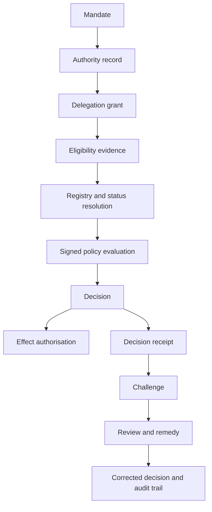

# End-to-end walkthrough

| Step | Activity | Primary fixture | Illustrative threat/control |
|---|---|---|---|
| `RS-STEP-01` | Establish scheme mandate | `authority-record.yaml` | `THR-001`, `CTL-001` |
| `RS-STEP-02` | Register applicant and delegate | `participant-record.yaml` | `THR-009`, `CTL-007` |
| `RS-STEP-03` | Create bounded delegation | `delegation-record.yaml` | `THR-006`, `CTL-005` |
| `RS-STEP-04` | Present eligibility evidence | `credential.json` | `THR-013`, `CTL-010` |
| `RS-STEP-05` | Resolve source and status | `registry-response.json` | `THR-017`, `CTL-015` |
| `RS-STEP-06` | Evaluate signed policy | `policy.json` | `THR-021`, `CTL-019` |
| `RS-STEP-07` | Issue decision and effect authorisation | `decision-receipt.json` | `THR-023`, `CTL-022` |
| `RS-STEP-08` | Record audit evidence | `audit-entry.json` | `THR-029`, `CTL-029` |
| `RS-STEP-09` | Submit affected-party challenge | `challenge-request.json` | `THR-046`, `CTL-032` |
| `RS-STEP-10` | Issue remedy and correction | `remedy-decision.json` | `THR-047`, `CTL-032` |

## Decision chain

Each step records the responsible function, relevant authority, input evidence, status, policy version, resulting state, and review path. The chain is incomplete if the decision can be executed without a receipt or if the affected party cannot obtain and challenge the evidence used.
