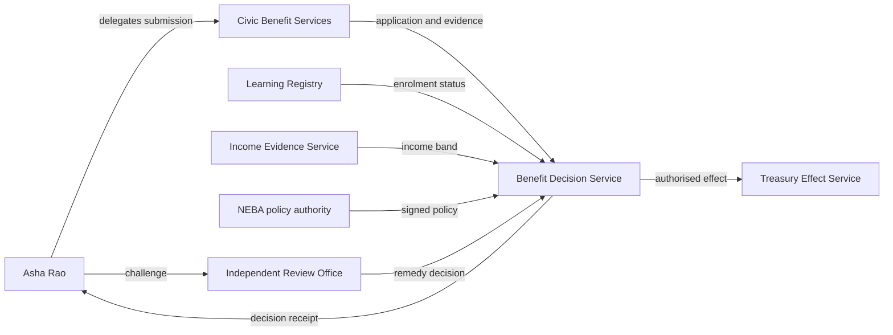

# Scenario overview

A fictional national education-benefit scheme permits an eligible learner to appoint a registered community service organisation to submit an application on the learner's behalf. The scheme operator evaluates eligibility evidence, confirms the delegate's mandate and the current status of the evidence providers, issues a decision receipt, and makes a provisional payment authorisation. The learner later challenges an incorrect income classification. The decision is reviewed, corrected, and the remedy is recorded.

## Actors

- **National Education Benefit Authority (NEBA):** scheme authority and policy owner.
- **Civic Benefit Services (CBS):** registered delegate organisation.
- **Asha Rao:** fictional applicant and affected party.
- **National Learning Registry:** evidence source for enrolment status.
- **Income Evidence Service:** evidence source for income band.
- **Benefit Decision Service:** policy decision point.
- **Treasury Effect Service:** executes approved payment authorisations.
- **Independent Review Office:** challenge and remedy function.

