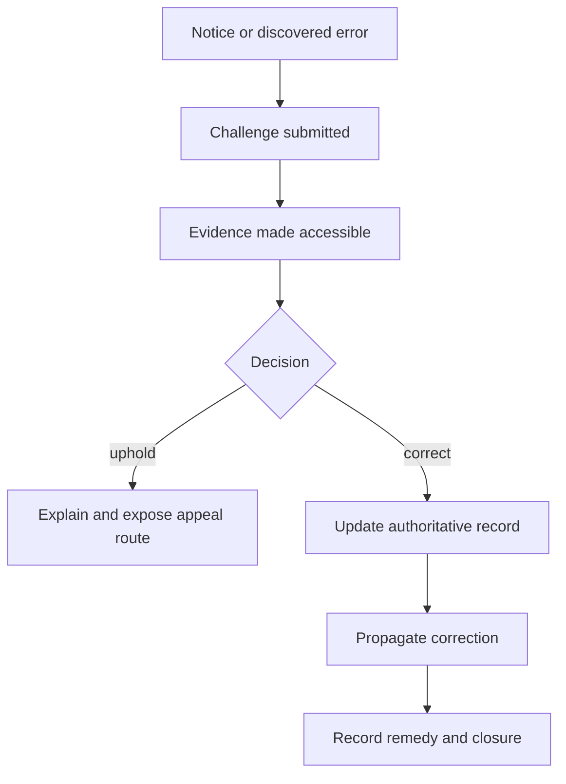
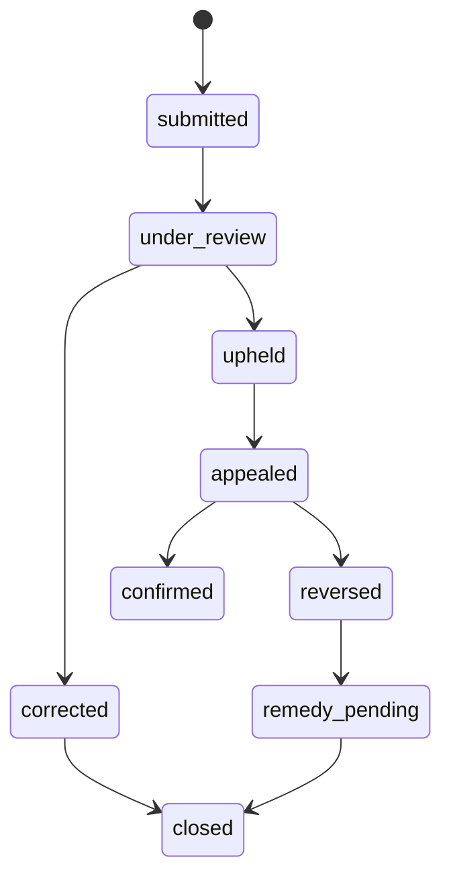
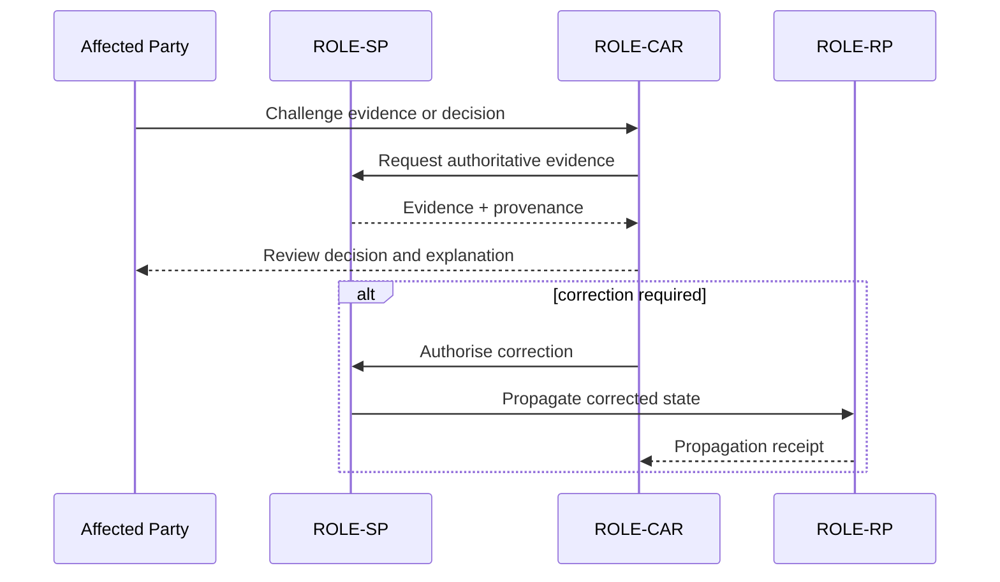

# Challenge and correction

Challenge enables an affected party to contest evidence, identity binding, authority, delegation, status, policy interpretation or procedure. The process must support accessible intake, acknowledgement, preservation of records, correction of inaccurate data, interim protection where harm may continue and a reasoned outcome.

The framework must state which entity owns each correction action and how corrected information propagates to registries, relying parties, caches and downstream decisions.

## Challenge and correction views

### Flow view

### State view

### Swimlane view

