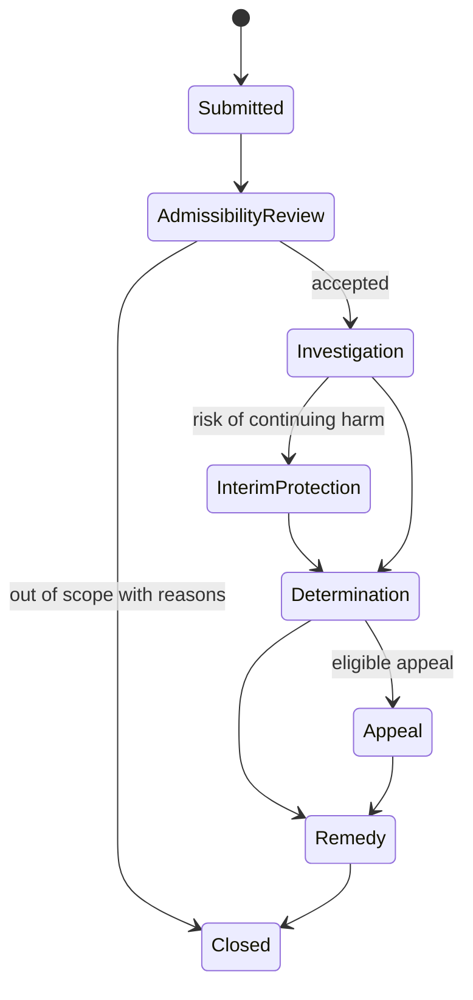

# Challenge, grievance and appeal

A challenge process SHALL accept disputes about identity, authority, evidence, status, policy application, procedural fairness, privacy, and resulting effects.

Processes SHOULD specify deadlines, independence, evidence access, interim safeguards, conflict handling, escalation, and preservation of records.
