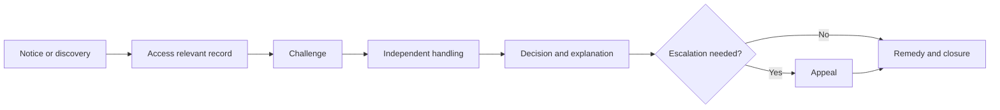

# Rights and redress

ONDTF treats affected parties as governance subjects, not merely data subjects or transaction participants. A person or organisation may be affected by a trust decision without issuing, holding, presenting, or verifying a credential.

## Publication set

- [Affected Parties and Participation](affected-parties.md)
- [Transparency, Notice and Explanation](transparency-explanation.md)
- [Challenge, Grievance and Appeal](challenge-appeal.md)
- [Remedies and Accountability](remedies-accountability.md)
