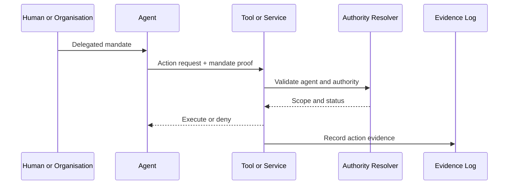

# AI and Software-Agent Profile

Software agents are not treated as independent legal persons by default. They act through authority derived from a person or organisation and within an identifiable governance regime.

An agent action SHOULD be accompanied by evidence of:

- agent instance and software provenance;
- operator and accountable principal;
- delegated mandate;
- permitted tools and resources;
- policy and risk constraints;
- transaction context;
- human-oversight requirements;
- revocation and termination state.

