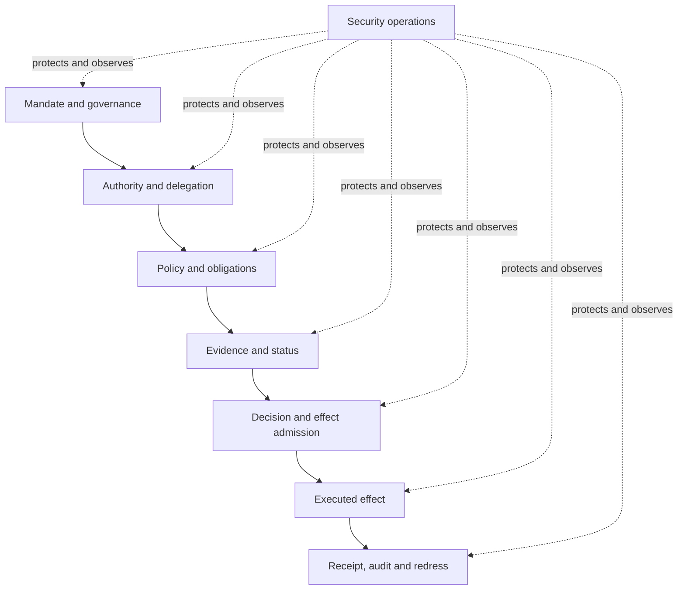

# Security architecture

ONDTF treats security as a property of the complete trust system, not merely of its cryptographic mechanisms or software components. A technically valid credential, signature, registry response, or policy decision can still contribute to an unsafe outcome when authority is mis-scoped, evidence is stale, duties are unclear, or an effect cannot be contained or challenged.

The security architecture therefore protects the integrity of **authority, evidence, policy, decision, effect, accountability, and recovery** across organisational and technical boundaries.

## Purpose of this section

This section establishes the security foundations that later ONDTF security work will elaborate into threat, control, privacy, assurance, risk, metric, and incident catalogues. It defines:

- [the security architecture](security-architecture.md) and its relationship to the ONDTF reference architecture;
- [security principles](security-principles.md) that constrain design and operation;
- [security objectives](security-objectives.md) and the outcomes that must be protected;
- [security domains](security-domains.md) used to organise responsibilities and controls;
- [trust assumptions](trust-assumptions.md), including assumptions that must not be made implicitly;
- [protected assets](protected-assets.md), including institutional, semantic, operational, and accountability assets;
- [security boundaries](security-boundaries.md), including governed boundary states and crossing evidence;
- the [threat taxonomy](threat-taxonomy.md), [adversary model](adversary-model.md), [attack surfaces](attack-surfaces.md), and [threat catalogue](threat-catalogue.md);
- the structured [security control framework](control-framework.md);
- a [worked reference scenario](../reference-scenario/) that instantiates threats, controls, evidence, decision, challenge, and remedy.

## Security architecture position

Security controls MUST preserve the meaning and legitimacy of this chain. Protecting transport or storage while allowing an invalid authority grant, manipulated policy, suppressed status change, or unreviewable effect does not satisfy the ONDTF security objective.

## Relationship to assurance and privacy

Security, privacy, and assurance are related but distinct:

- **Security** protects the system and its trust decisions against unauthorised, deceptive, unsafe, or disruptive action.
- **Privacy** constrains how information about people, organisations, relationships, and activity may be collected, disclosed, correlated, retained, and used.
- **Assurance** establishes the justified confidence that a stated property, control, or outcome is true within a declared scope and time.

No one of these substitutes for the others. A secure system can still be privacy-invasive. A privacy-preserving system can still admit an unauthorised action. An independently assessed system can still operate outside the scope that was assessed.

## Status

The material in this section is part of the developing v0.5.0 baseline. It is published incrementally for review but does not constitute a separately released ONDTF version until the security, privacy, assurance, risk, control, measurement, and incident work is integrated and passes the v0.5.0 release gates.
