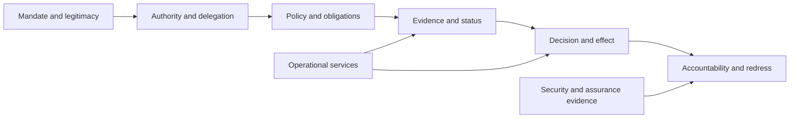

# Protected asset catalogue

ONDTF security protects more than infrastructure, cryptographic keys, and personal information. A national digital trust framework also depends on institutional mandates, bounded authority, authoritative policy, current status, explainable decisions, executable remedies, and public confidence. Compromise of any of these assets can produce a technically valid but illegitimate outcome.

This catalogue establishes the asset classes that later threat, control, risk, assurance, and incident work MUST reference. It does not prescribe a particular storage technology, protocol, or operating model.

## Asset protection model



An implementation MUST identify which assets it holds, processes, publishes, evaluates, or depends upon. It MUST also identify the authority responsible for each asset, its authoritative source, required protection properties, acceptable staleness, and recovery obligations.

## Canonical asset classes

| ID | Asset class | Examples | Primary protection concerns |
|---|---|---|---|
| AST-01 | Mandate and legitimacy records | legislation, charter, designation, recognition decision | authenticity, current applicability, non-repudiation, reviewability |
| AST-02 | Governance decisions | policy approval, emergency activation, delegation of institutional responsibility | authorised change, separation of duties, traceability, expiry |
| AST-03 | Authority and privilege records | authority grants, delegations, administrator roles, signing authority | scope, attenuation, revocation, misuse detection |
| AST-04 | Participant and role records | enrolment, standing, role assignment, competence record | correctness, freshness, anti-impersonation, correction |
| AST-05 | Policies, duties, and prohibitions | eligibility rules, verification policy, disclosure rules, operating constraints | version integrity, authorised provenance, deterministic interpretation |
| AST-06 | Credentials, claims, and attestations | identity credential, licence, accreditation, eligibility assertion | authenticity, status, semantic scope, selective disclosure |
| AST-07 | Evidence and provenance | source records, assessment evidence, transformation history, audit evidence | completeness, integrity, chain of custody, admissibility |
| AST-08 | Registries, directories, and status data | issuer registry, participant registry, revocation or suspension status | authoritative origin, freshness, availability, anti-poisoning |
| AST-09 | Assurance assertions | assessment result, control attestation, certification scope, exception record | independence, scope accuracy, expiry, evidence linkage |
| AST-10 | Trust decisions | admit, deny, defer, condition, or escalate outcomes | contextual binding, reproducibility, policy and evidence linkage |
| AST-11 | Effects and execution authorisations | payment release, access grant, registration, eligibility determination | action binding, replay prevention, scope, reversibility |
| AST-12 | Decision receipts and audit trails | decision receipt, event log, reason code, evaluator identity | integrity, completeness, time ordering, access control |
| AST-13 | Incident and recovery records | incident report, containment action, restoration evidence | timeliness, accuracy, confidentiality, post-incident preservation |
| AST-14 | Challenge, appeal, and remedy records | complaint, correction request, appeal decision, remedy completion | accessibility, integrity, confidentiality, enforceability |
| AST-15 | Cryptographic and authentication material | private keys, trust anchors, credentials, tokens, recovery secrets | secrecy, integrity, rotation, compromise recovery |
| AST-16 | Software, configuration, and policy code | resolver, verifier, rules engine, deployment configuration | provenance, supply-chain integrity, authorised deployment |
| AST-17 | Operational telemetry and service state | health data, alerting, capacity state, dependency status | availability, integrity, privacy, anti-suppression |
| AST-18 | Personal, organisational, and relationship information | identifiers, attributes, transactions, affiliations, delegation chains | minimisation, confidentiality, unlinkability, lawful use |
| AST-19 | Federation and recognition mappings | equivalence map, foreign-domain recognition, assurance translation | semantic accuracy, jurisdictional scope, withdrawal handling |
| AST-20 | Public trust and institutional continuity | public notices, transparency reports, continuity plans | accuracy, availability, consistency, credible recovery |
| AST-21 | Automated-agent mandates and tool-invocation records | agent authority scope, tool permission grants, invocation and delegation logs | mandate boundedness, prompt/instruction integrity, attributable execution, human-override capability |

## Protection properties

The familiar confidentiality, integrity, and availability properties remain necessary but are not sufficient. ONDTF assets may additionally require:

- **authority integrity**, ensuring that creation, modification, suspension, and use are performed by a competent authority;
- **semantic integrity**, ensuring that the meaning of an asset is not broadened, narrowed, or translated incorrectly;
- **scope integrity**, ensuring that an asset is used only for the context, purpose, jurisdiction, population, and period for which it is valid;
- **freshness**, ensuring that a decision does not rely on state older than the permitted exposure window;
- **provenance**, ensuring that origin, transformation, custody, and evaluation are reconstructable;
- **non-equivocation**, ensuring that authoritative services do not present inconsistent state without detection;
- **contestability**, ensuring that material errors can be challenged and corrected;
- **recoverability**, ensuring that trustworthy operation can be restored after compromise;
- **unlinkability**, where required, ensuring that legitimate uses cannot be unnecessarily correlated;
- **public legibility**, ensuring that rules and institutional responsibilities remain understandable to affected parties.

## Criticality classification

Each profile or implementation SHOULD classify assets using at least four dimensions:

| Dimension | Question |
|---|---|
| Consequence | What legal, financial, safety, liberty, eligibility, privacy, or systemic harm can follow from compromise? |
| Reach | How many people, organisations, transactions, or dependent systems can be affected? |
| Reversibility | Can the resulting effect be stopped, corrected, compensated, or recalled? |
| Dependency | How many other trust decisions depend on this asset or service? |

An asset MAY be highly critical even where it contains no sensitive personal information. A corrupted authority registry, policy record, or recognition mapping can create systemic harm without disclosing any confidential data.

## Asset ownership and custodianship

For every protected asset, the operating model MUST distinguish:

- the **authoritative owner**, which is accountable for meaning and validity;
- the **custodian**, which stores or operates the asset;
- the **publisher**, which makes the asset discoverable;
- the **evaluator**, which relies upon the asset;
- the **assurance provider**, which assesses its controls or trustworthiness;
- the **affected party**, whose rights or interests may be changed by its use.

Combining these roles is not automatically prohibited, but the resulting concentration and conflict risks MUST be documented and treated.

## Minimum asset record

An asset inventory entry SHOULD include:

```text
Asset identifier
Asset class
Authoritative owner
Custodian and processing locations
Purpose and permitted uses
Authoritative source
Protection properties
Criticality classification
Freshness or expiry requirement
Dependent services and decisions
Access and change authority
Monitoring and assurance evidence
Recovery objective
Retention and disposal rule
Affected-party and redress implications
```

## Failure and compromise handling

When an asset is suspected to be compromised, the responsible authority MUST determine whether to:

1. suspend reliance;
2. narrow the permitted scope;
3. require corroborating evidence;
4. revoke or replace the asset;
5. notify dependent services and domains;
6. preserve evidence;
7. identify affected decisions and effects;
8. initiate correction, appeal, compensation, or other remedy;
9. reassess controls and assurance claims before restoration.

Restoration of technical availability alone does not establish that the asset is trustworthy again.

## Relationship to later catalogues

Subsequent v0.5.0 work will map each asset class to:

- threat events and adversary objectives;
- trust boundaries and attack surfaces;
- preventive, detective, corrective, and recovery controls;
- assurance evidence;
- risk indicators and trustworthiness metrics;
- incident classifications and response playbooks.
