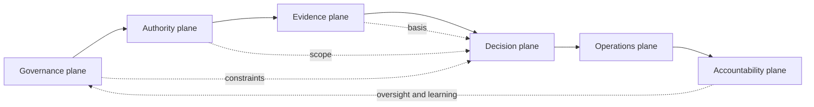
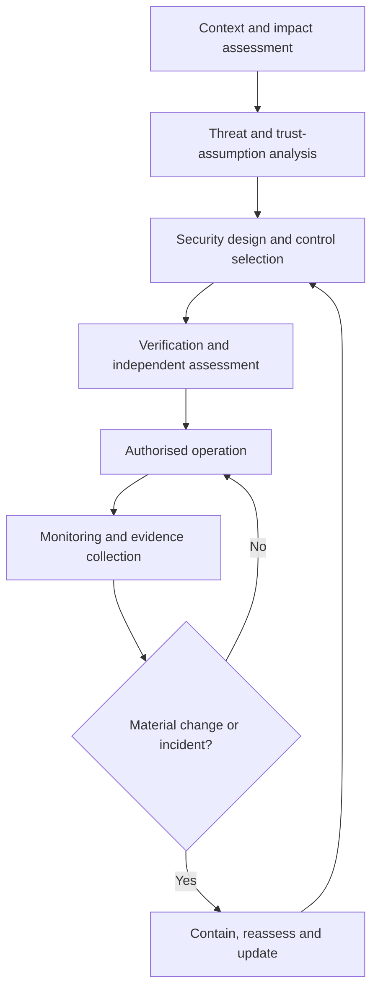

# Security architecture foundation

The ONDTF security architecture defines how a national digital trust framework preserves authorised, evidence-based, reviewable, and recoverable operation under expected use, misuse, partial failure, and adversarial pressure.

It applies to the complete socio-technical system, including governing bodies, public authorities, scheme operators, assessors, participants, service providers, automated agents, technical components, operational processes, and cross-domain relationships.

## Security problem statement

A national trust framework creates mechanisms through which assertions can be accepted, authority can be exercised, and consequential effects can be admitted at scale. These mechanisms concentrate value and can amplify error or abuse. The security problem is therefore broader than preventing unauthorised access.

ONDTF security must prevent or contain at least the following outcome classes:

1. an actor being treated as authorised when it is not;
2. valid authority being exercised outside its purpose, scope, time, or conditions;
3. false, altered, stale, incomplete, or mis-scoped evidence influencing a decision;
4. a valid decision being altered, replayed, suppressed, or executed incorrectly;
5. a consequential effect occurring without a reviewable decision basis;
6. governance or emergency powers being captured or used without accountable limits;
7. compromise in one participant, service, or domain propagating without containment;
8. an affected party being unable to discover, challenge, correct, or remedy an unsafe outcome;
9. security measures themselves creating disproportionate surveillance, exclusion, or concentration risk.

## Security architecture scope

The security architecture covers:

- governance and mandate integrity;
- authority grants, delegation chains, and privilege boundaries;
- policy authorship, approval, publication, interpretation, and versioning;
- identity, role, credential, evidence, registry, and status integrity;
- service-to-service and cross-domain trust-boundary crossings;
- decision construction, effect admission, and effect execution;
- receipts, logs, provenance, audit evidence, and non-repudiable accountability;
- cryptographic, software, infrastructure, operational, and supply-chain security;
- monitoring, detection, containment, continuity, recovery, and post-incident reassessment;
- the interaction between security controls, privacy duties, assurance claims, and redress.

It does not prescribe one security product, protocol, cryptographic suite, hosting model, or national institutional structure.

## Security planes

ONDTF distributes security responsibilities across six planes.

| Plane | Security purpose | Examples of protected outcomes |
|---|---|---|
| Governance plane | Preserve legitimate mandate, decision rights, oversight, and change control | authorised policy, bounded emergency power, accountable exceptions |
| Authority plane | Preserve the validity and attenuation of authority and delegation | current grants, non-escalating delegation, privilege separation |
| Evidence plane | Preserve evidence authenticity, provenance, relevance, freshness, and disclosure limits | untampered evidence, trustworthy status, controlled disclosure |
| Decision plane | Preserve correct policy evaluation, risk handling, and effect admission | reproducible decision, replay resistance, contextual binding |
| Operations plane | Preserve secure and resilient service delivery | hardened administration, monitored dependencies, safe degradation |
| Accountability plane | Preserve reviewability, incident evidence, challenge, and remedy | complete receipt, protected audit trail, effective redress |

The diagram expresses dependency, not a single runtime sequence. A jurisdiction may distribute these planes across different organisations or systems. Where one entity performs multiple functions, it MUST document the resulting concentration and conflict risks and apply compensating controls.

## Security lifecycle

Security must be maintained through the complete lifecycle of a trust capability or service.

A security approval MUST NOT be treated as permanent. Reassessment triggers include material changes to mandate, policy, authority, implementation, dependencies, threat conditions, data use, assurance scope, cross-domain recognition, or incident history.

## Architecture obligations

An adopting framework MUST:

- define its security objectives and impact assumptions;
- identify accountable security decision makers and operational responsibilities;
- identify trust boundaries and privileged functions;
- document the trust assumptions on which consequential decisions depend;
- maintain a threat model covering governance, organisational, human, technical, and cross-domain threats;
- select and operate controls proportionate to the effects that can be produced;
- preserve evidence sufficient to review consequential decisions and material incidents;
- define safe failure, containment, continuity, and recovery behaviour;
- reassess security when assumptions or operating conditions materially change;
- avoid treating authentication, cryptographic validity, or conformance status as sufficient proof of safe authority exercise.

## Security decision hierarchy

Security decisions should be made at the lowest competent level while remaining accountable to the authority that bears the consequence of failure.

| Decision | Minimum accountable role |
|---|---|
| Accept a material trust assumption | accountable framework or scheme authority |
| Approve a high-impact security exception | authority owning the affected risk |
| Activate emergency operation | explicitly designated emergency authority |
| Resume after material compromise | accountable operator with independent assurance input |
| Accept residual systemic risk | governing authority, not a technical service provider |
| Recognise an external security or assurance claim | recognition authority within declared scope |

Operational convenience MUST NOT silently transfer these decisions to vendors, integrators, automated systems, or foreign trust domains.

## Relationship to later v0.5.0 work

This foundation will be specialised by the forthcoming:

- protected-asset and attack-surface catalogues;
- adversary and threat taxonomy;
- privacy architecture;
- assurance-domain and assurance-level model;
- control catalogue;
- risk-management model;
- trustworthiness metrics;
- incident, resilience, and recovery specifications;
- machine-readable traceability between threats, controls, evidence, assurance, and metrics.
